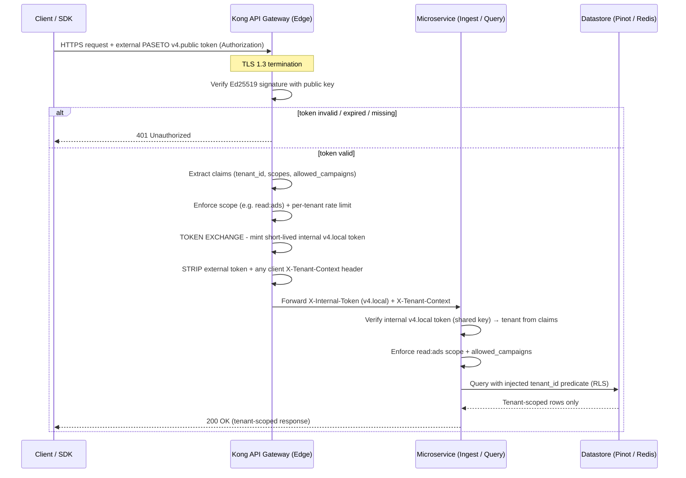

# Authentication & Authorization: Edge-Validated PASETO, Header-Propagated Trust

> **Status:** Reference architecture + current implementation
> **Last validated:** 2026-06-26 (code review — all gaps below resolved)
> **Audience:** Platform engineers, SREs, security reviewers, integrators
> **Related:** `architecture.md` §6 (Multi-Tenancy & Logical Data Isolation)

This document describes, end to end, how requests are authenticated and how
tenant identity flows through the Streaming Insight Platform. The model is
summarised in one phrase:

> **Edge-validated PASETO, header-propagated trust.**

That means: a cryptographic token (**PASETO**) is verified at the **edge
gateway**, which injects a small, sanitized **identity header**
(`X-Tenant-Context`) derived from the verified token. Everything behind the
gateway consumes that uniform header contract and scopes all data access to it.

> **Implementation update (2026-06-25) — Option C (token exchange):** the
> deployed model is now **edge-verify + token-exchange**, which makes the
> "external token never crosses the boundary" guarantee literally true again.
> The edge gateway verifies the external **`v4.public`** token, then **re-mints a
> short-lived internal `v4.local`** token (symmetric XChaCha20 + keyed BLAKE2b)
> carrying the already-validated claims, and forwards *that* on an internal
> header (`X-Internal-Token`). Each service verifies the internal token with a
> shared symmetric key (`shared-security`) and derives the tenant from the
> **verified claims**. The original external token is consumed at the edge and
> never enters the mesh.
>
> The verifier is pluggable via `platform.security.paseto.mode`:
> `local` (default for deployed envs — Option C) or `public` (verify the external
> token directly). When verification is **disabled** (local dev,
> `enabled=false`), services fall back to trusting the gateway-injected
> `X-Tenant-Context`. Sections [7](#7-in-service-enforcement-current-code) and
> [13](#13-in-service-verification-implemented) reflect the current code.

---

## Table of Contents

- [1. Why This Model](#1-why-this-model)
- [2. The Two Trust Zones](#2-the-two-trust-zones)
- [3. End-to-End Request Flow](#3-end-to-end-request-flow)
- [4. The PASETO Token](#4-the-paseto-token)
  - [4.1. Why PASETO over JWT](#41-why-paseto-over-jwt)
  - [4.2. Token Shape & Claims](#42-token-shape--claims)
  - [4.3. Key Management & Rotation](#43-key-management--rotation)
- [5. Edge Validation (Kong Gateway)](#5-edge-validation-kong-gateway)
- [6. Header Propagation Contract](#6-header-propagation-contract)
- [7. In-Service Enforcement (Current Code)](#7-in-service-enforcement-current-code)
  - [7.1. PASETO Authentication Filter (verify-everywhere)](#71-paseto-authentication-filter-verify-everywhere)
  - [7.2. Fail-Closed Wiring](#72-fail-closed-wiring)
  - [7.3. Ingestion Service](#73-ingestion-service)
  - [7.4. Insights Query Service](#74-insights-query-service)
- [8. Authorization: Tenant Scoping & Row-Level Security](#8-authorization-tenant-scoping--row-level-security)
- [9. Configuration Reference](#9-configuration-reference)
- [10. Threat Model & Mitigations](#10-threat-model--mitigations)
- [11. Failure Modes & HTTP Semantics](#11-failure-modes--http-semantics)
- [12. Testing Authentication](#12-testing-authentication)
- [13. In-Service Verification (Implemented)](#13-in-service-verification-implemented)
- [14. FAQ](#14-faq)

---

## 1. Why This Model

High-throughput ingestion and low-latency query services should not each pay the
cost of full token cryptography on every request, nor should every team
re-implement token parsing (a common source of security bugs). Instead:

| Goal | How this model achieves it |
| :--- | :--- |
| **Single source of auth truth** | The gateway validates tokens; the verifier logic is also centralized in one reusable `shared-security` module. |
| **Defense-in-depth** | Services re-verify the token in-process (`@Order(0)` filter) — not just a header presence check. |
| **Uniform identity** | Every downstream service sees the same `X-Tenant-Context` contract, always derived from verified claims. |
| **Reduced attack surface** | The raw token is consumed at the edge; in the mesh the verified tenant is the contract, and a forged header is overwritten. |
| **Fast edge throughput** | PASETO's versioned format skips JWT header-parsing overhead at peak. |

The original tradeoff — internal services *blindly trust* the header — has been
**removed** for deployed environments: with `paseto.enabled=true`, services
verify the token themselves and derive the tenant from verified claims. The
header-trust behaviour now applies **only** to local development
(`paseto.enabled=false`), where the network is a single controlled trust zone
(see §2) and the header is still stripped/overwritten at the edge (see §6).

---

## 2. The Two Trust Zones

```
        UNTRUSTED ZONE                 │            TRUSTED ZONE
  (public internet, clients)           │      (private mesh / cluster)
                                       │
  ┌─────────────┐  external            │   internal v4.local token
  │  Client/SDK │  v4.public token  ┌──┴───┐  (X-Internal-Token)        ┌───────────────┐
  └─────────────┘ ───────────────►  │ Kong │ ─────────────────────────► │ Microservices │
                  (Authorization)   │ Edge │   + X-Tenant-Context        │ (ingest/query)│
                                    └──┬───┘                             └───────────────┘
   External token verified HERE.      │   External token consumed HERE; a short-lived
   Internal token minted HERE.        │   internal token (re-minted) is what crosses.
```

- **Untrusted zone:** clients present a signed external **`v4.public`** token.
  Nothing is trusted.
- **Trust boundary (the gateway):** verifies the external token, then performs a
  **token exchange** — it mints a short-lived internal **`v4.local`** token
  (symmetric) carrying the verified claims, and forwards it on `X-Internal-Token`.
  The external token is **consumed here and never forwarded**.
- **Trusted zone:** services **verify the internal `v4.local` token** with the
  shared symmetric key and derive the tenant from its claims. They no longer have
  to trust the network — the token itself is authenticated in-process. (When
  verification is disabled for local dev, they fall back to trusting
  `X-Tenant-Context`, which the gateway still strips/injects — see §6.)

---

## 3. End-to-End Request Flow



**Plain-language walkthrough:**

1. The client calls the public endpoint over **TLS 1.3**, presenting an external
   **PASETO `v4.public`** token.
2. Kong **verifies the Ed25519 signature** against the platform public key.
   Invalid/expired/missing → **401** immediately; the request never reaches a
   service.
3. Kong **extracts claims** (`tenant_id`, `scopes`, `allowed_campaigns`),
   enforces the required **scope** and the tenant's **rate limit**.
4. Kong performs a **token exchange**: it mints a short-lived internal
   **`v4.local`** token with the verified claims, **strips** the external token
   (it never enters the mesh) and any client `X-Tenant-Context`, and forwards the
   internal token on `X-Internal-Token`.
5. The microservice **verifies the internal `v4.local` token** with the shared
   symmetric key, derives the tenant from the verified claims, and enforces
   `read:ads` + `allowed_campaigns`. Missing/invalid → **401/403**.
6. The service queries the datastore with the **tenant_id forced into the
   predicate** (Row-Level Security), so cross-tenant reads are impossible.

---

## 4. The PASETO Token

### 4.1. Why PASETO over JWT

PASETO (Platform-Agnostic Security Token) is chosen specifically to eliminate
JWT's well-known footguns:

| Security vector | Legacy JWT | PASETO `v4.public` |
| :--- | :--- | :--- |
| **Algorithm confusion** (`RS256`→`HS256`) | Vulnerable — attacker can swap the `alg` header. | Immune — no arbitrary `alg`; `v4.public` is fixed to **Ed25519**. |
| **`alg: none`** | Historically accepted by many parsers. | Impossible — signatures are mandatory. |
| **Weak crypto agility** | Allows SHA-1/short keys via config. | Opinionated — primitives locked per version. |
| **Validation performance** | Parse arbitrary JSON header first. | Version string (`v4.public.`) short-circuits parsing → faster at the edge. |

**Bottom line:** PASETO removes entire classes of token-forgery attacks by
*removing configurability*, and is faster to validate under peak shopping load.

### 4.2. Token Shape & Claims

A `v4.public` token is a signed (not encrypted) token: the payload is readable
but tamper-evident. Conceptual decoded payload:

```json
{
  "tenant_id": "walmart_us",
  "scopes": ["read:ads", "write:events"],
  "allowed_campaigns": ["cmp_spring_99a", "cmp_singles_day"],
  "iss": "auth.platform.internal",
  "aud": "event-analysis",
  "iat": "2026-06-25T10:00:00Z",
  "exp": "2026-06-25T10:15:00Z"
}
```

| Claim | Purpose |
| :--- | :--- |
| `tenant_id` | The retailer identity → becomes `X-Tenant-Context`. |
| `scopes` | Coarse permissions (e.g. `read:ads`, `write:events`). |
| `allowed_campaigns` | Optional fine-grained allow-list for campaign queries. |
| `iss` / `aud` | Issuer/audience binding — reject foreign tokens. |
| `iat` / `exp` | Issued-at / expiry — keep tokens short-lived (≈15 min). |

> **Wire format:** `v4.public.<base64url-payload>.<base64url-signature>`. The
> leading `v4.public.` lets the verifier reject anything that isn't the exact
> expected version before doing any work.

### 4.3. Key Management & Rotation

- **Asymmetric keys:** the auth server signs with the **Ed25519 private key**;
  the gateway verifies with the **public key** only. Services hold *no* keys.
- **Distribution:** the public key is delivered to the gateway as a Kubernetes
  Secret (`PASETO_PUBLIC_KEY`), synced by the External Secrets Operator / Vault.
  It is **never** committed to git or placed in a ConfigMap.
- **Rotation:** publish the new public key alongside the old (key id / `kid`
  convention), roll the signer to the new private key, then retire the old
  public key after the max token lifetime (≈15 min) has elapsed. Because tokens
  are short-lived, rotation windows are small.
- **Blast radius:** a leaked *public* key is harmless (it only verifies). A
  leaked *private* key requires immediate rotation + revocation of the signer.

> **Internal `v4.local` key (Option C).** The internal token is symmetric, so the
> gateway (issuer) and the services (verifiers) share a **32-byte secret**
> (`PASETO_LOCAL_KEY`). Treat it like any shared secret: deliver via External
> Secrets/Vault into `app-secrets`, never commit it, and **rotate the gateway and
> services together** with an overlap window ≥ the max internal token TTL
> (~30–60 s). A leaked symmetric key lets an attacker mint internal tokens, so
> rotate immediately on suspicion; a `kid` footer can disambiguate keys during an
> overlapping rotation.

---

## 5. Edge Validation (Kong Gateway)

The gateway is the **policy enforcement point (PEP)**. On every request it:

1. **Terminates TLS 1.3** and accepts the external PASETO token (typically in the
   `Authorization` header).
2. **Verifies** the external `v4.public` Ed25519 signature with `PASETO_PUBLIC_KEY`.
3. **Validates claims:** `exp` not passed, `iss`/`aud` match, required `scope`
   present for the route (e.g. `read:ads` for `GET /ad/...`).
4. **Applies per-tenant rate limiting** (token-bucket, keyed by `tenant_id`).
5. **Token exchange (Option C):** mints a short-lived internal **`v4.local`**
   token with the verified claims (shared symmetric key), and **consumes** the
   external token (does not forward it).
6. **Sanitizes + injects headers** (see §6): strips client `X-Internal-Token` /
   `X-Tenant-Context`, then injects the minted internal token + tenant.
7. **Forwards** the request into the trusted zone, or returns **401/403/429**.

> The external token is verified here and **only** here; services then verify the
> *internal* token. This is the deliberate design center of "edge-validated +
> token exchange."

---

## 6. Header Propagation Contract

The contract between the gateway and all services:

| Header | Set by | Trusted by services? | Notes |
| :--- | :--- | :--- | :--- |
| `Authorization` (external `v4.public`) | Client | ❌ Never reaches services | Verified + **consumed** at the edge; not forwarded. |
| `X-Internal-Token` (internal `v4.local`) | **Gateway only** | ✅ Verified in-service | Short-lived, gateway-minted; the in-service source of truth (Option C). |
| `X-Tenant-Context` | **Gateway only** | ✅ (fast contract) | Equals the verified `tenant_id`; rewritten in-service from the verified internal token. |

**Critical anti-spoofing rules:**

1. The gateway **does not forward** the external `Authorization` token into the
   mesh — it is consumed at the edge.
2. The gateway **unconditionally strips** any inbound `X-Tenant-Context` *and*
   `X-Internal-Token` from the client before injecting its own. A client cannot
   smuggle a forged internal token or tenant header through the edge.
3. Services **verify** `X-Internal-Token` cryptographically (shared symmetric
   key), so even a leaked/forged header is rejected unless it carries a valid
   gateway signature/MAC.

> With Option C enabled (the deployed default), services do **not** rely on the
> network at all: the internal `v4.local` token is authenticated in-process and
> `X-Tenant-Context` is rewritten from its verified claims (see §7.1, §13). In
> local dev (`enabled=false`), services fall back to trusting `X-Tenant-Context`,
> which is safe only because the gateway strips/injects it and services aren't
> directly reachable.

The validated tenant is also re-exposed inside the service as a request
attribute for downstream components (constant `TENANT_ATTRIBUTE = "tenantContext"`),
and the full verified claims are exposed as the `pasetoClaims` attribute.

---

## 7. In-Service Enforcement (Current Code)

Services now implement **two layers** of enforcement:

1. **In-service PASETO verification** (`PasetoAuthenticationFilter`, `@Order(0)`)
   — when `platform.security.paseto.enabled=true`, the service itself verifies
   the Ed25519 signature, validates `exp`/`nbf`/`iss`/`aud`, derives the tenant
   from the **verified claims**, and re-injects a trusted `X-Tenant-Context`.
2. **Header presence checks** (`TenantContextFilter` / controller) — a
   defense-in-depth floor that still rejects requests lacking the tenant header,
   so the contract holds even when verification is disabled (local dev) or in
   unit tests that bypass the filter.

### 7.1. PASETO Authentication Filter (verify-everywhere)

Both HTTP services register a shared-pattern filter at the very front of the
chain (`@Order(0)`). It reads the gateway-forwarded token from the configured
`token-header` (`X-Internal-Token` in Option C / local mode, or `Authorization`
in public mode), verifies it with a `shared-security` **`PasetoVerifier`** — the
pluggable abstraction implemented by both `PasetoV4LocalVerifier` (internal
`v4.local`) and `PasetoV4PublicVerifier` (external `v4.public`) — and
**overrides** `X-Tenant-Context` from the verified `tenant_id` using a request
wrapper, so no client-supplied tenant header is ever trusted.

Additionally each service enforces its path-specific required scope **before
passing control downstream**:

- **Ingestion service** (`write:events` scope): requests without the ingest scope
  receive **403 Forbidden** immediately after token verification.
- **Insights query service** (`read:ads` scope): same pattern, enforced before the
  controller for all `/ad/**` endpoints.

```java
@Component
@Order(0)
public final class PasetoAuthenticationFilter extends OncePerRequestFilter {

    public static final String CLAIMS_ATTRIBUTE = "pasetoClaims";
    private static final Logger AUDIT = LoggerFactory.getLogger("SECURITY_AUDIT");

    // Ingestion service uses WRITE_SCOPE = "write:events"
    // Insights service uses READ_SCOPE  = "read:ads"

    @Override
    protected boolean shouldNotFilter(HttpServletRequest request) {
        // Pass-through when disabled (verifier == null) and never gate probes.
        return verifier == null || request.getRequestURI().startsWith("/actuator");
    }

    @Override
    protected void doFilterInternal(HttpServletRequest request, HttpServletResponse response,
                                    FilterChain chain) throws ServletException, IOException {
        String token = request.getHeader(props.getTokenHeader());   // e.g. X-Internal-Token
        try {
            PasetoClaims claims = verifier.verify(token);           // sig + exp/nbf/iss/aud
            if (claims.tenantId() == null || claims.tenantId().isBlank()) {
                AUDIT.warn("event=auth_denied reason=missing_tenant path={}", request.getRequestURI());
                unauthorized(response, "Token missing tenant_id");
                return;
            }
            // Scope enforcement (per-service): ingestion requires write:events,
            // insights query requires read:ads.
            if (!claims.hasScope(REQUIRED_SCOPE)) {
                AUDIT.warn("event=authz_denied reason=missing_scope tenant={} path={}",
                        claims.tenantId(), request.getRequestURI());
                deny(response, 403, "Missing required scope: " + REQUIRED_SCOPE);
                return;
            }
            request.setAttribute(CLAIMS_ATTRIBUTE, claims);
            AUDIT.info("event=auth_success tenant={} path={}", claims.tenantId(), request.getRequestURI());
            // Force the trusted tenant downstream regardless of client headers.
            chain.doFilter(new TenantOverrideRequest(request, claims.tenantId()), response);
        } catch (PasetoException ex) {
            AUDIT.warn("event=auth_denied reason=invalid_token path={}", request.getRequestURI());
            unauthorized(response, "Invalid or missing authentication token");
        }
    }
}
```

Key properties:

- **Token is the source of truth.** The tenant comes from verified claims; the
  `TenantOverrideRequest` wrapper rewrites `X-Tenant-Context` so downstream
  components (and the legacy presence checks) see only the trusted value.
- **Scope enforced per service.** Ingestion enforces `write:events`; query
  enforces `read:ads`. Missing scope → **403** immediately after token
  verification.
- **Claims exposed for authorization.** The full `PasetoClaims` are placed in the
  `pasetoClaims` request attribute for per-campaign checks (see §8).
- **Audit trail.** Every allow/deny is emitted to a dedicated `SECURITY_AUDIT`
  logger for SIEM ingestion (OWASP A09).
- **Pass-through when disabled.** If `paseto.enabled=false`, no verifier bean is
  created, `shouldNotFilter` returns `true`, and the legacy header-trust path
  (§7.3/§7.4) applies — intended for local development only.

### 7.2. Fail-Closed Wiring

`PasetoSecurityConfig` builds the verifier for the configured **mode** and adds a
**fail-closed startup guard**: if auth is enabled but the key required for the
mode is missing, the service **refuses to start** (no silent auth bypass —
OWASP A05/A07):

```java
private static final String MODE_LOCAL = "local";

@Bean
public PasetoVerifier pasetoVerifier(PasetoProperties props) {
    if (!props.isEnabled()) {
        return null; // disabled (local dev) -> filter passes through
    }
    Duration skew = Duration.ofSeconds(props.getClockSkewSeconds());
    if (MODE_LOCAL.equalsIgnoreCase(props.getMode())) {           // Option C
        return new PasetoV4LocalVerifier(props.getLocalKey(),
                props.getIssuer(), props.getAudience(), skew);
    }
    return new PasetoV4PublicVerifier(props.getPublicKey(),
            props.getIssuer(), props.getAudience(), skew);
}

@Bean
public ApplicationRunner pasetoKeyGuard(PasetoProperties props) {
    return args -> {
        if (!props.isEnabled()) return;
        boolean local = MODE_LOCAL.equalsIgnoreCase(props.getMode());
        String key = local ? props.getLocalKey() : props.getPublicKey();
        if (key == null || key.isBlank()) {
            throw new IllegalStateException(
                "PASETO is enabled (mode=" + props.getMode() + ") but the required key "
                    + (local ? "platform.security.paseto.local-key"
                             : "platform.security.paseto.public-key")
                    + " is missing — refusing to start (fail-closed).");
        }
    };
}
```

### 7.3. Ingestion Service

A servlet filter guards the ingest path **before** the controller runs as the
presence-check floor (runs after the verification filter).

`ingestion-service/.../security/TenantContextFilter.java`:

```java
@Component
@Order(1)
public final class TenantContextFilter extends OncePerRequestFilter {

    public static final String TENANT_HEADER    = "X-Tenant-Context";
    public static final String TENANT_ATTRIBUTE = "tenantContext";
    private static final String INGEST_PATH_PREFIX = "/v1/events";

    @Override
    protected void doFilterInternal(HttpServletRequest request,
                                    HttpServletResponse response,
                                    FilterChain filterChain) throws ServletException, IOException {

        if (request.getRequestURI().startsWith(INGEST_PATH_PREFIX)) {
            String tenant = request.getHeader(TENANT_HEADER); // verified value when auth is on
            if (tenant == null || tenant.isBlank()) {
                response.setStatus(HttpServletResponse.SC_UNAUTHORIZED); // 401
                response.setContentType("application/json");
                response.getWriter().write(
                        "{\"error\":\"Missing " + TENANT_HEADER + ". Authentication required.\"}");
                return;
            }
            request.setAttribute(TENANT_ATTRIBUTE, tenant);
        }
        filterChain.doFilter(request, response);
    }
}
```

- Runs after the verification filter (`@Order(1)` vs `@Order(0)`); when auth is
  enabled it reads the **verified** tenant that `PasetoAuthenticationFilter`
  injected.
- The controller (`IngestController`) **also** re-checks the header — intentional
  redundancy so the rule holds even when the filters aren't in the chain (tests).

### 7.4. Insights Query Service

Every read endpoint binds `X-Tenant-Context` **and** the verified `PasetoClaims`,
rejecting missing identity and enforcing per-campaign authorization.

`insights-query-service/.../controller/AdInsightsController.java`:

```java
@GetMapping("/{campaignID}/clicks")
public ResponseEntity<Map<String, Object>> clicks(
        @PathVariable("campaignID") String campaignId,
        /* ...query params... */
        @RequestHeader(value = "X-Tenant-Context", required = false) String tenant,
        @RequestAttribute(value = PasetoAuthenticationFilter.CLAIMS_ATTRIBUTE, required = false)
        PasetoClaims claims) {
    return respond(tenant, claims, campaignId, EventType.CLICK.name(), from, to, grain, placement);
}

private ResponseEntity<Map<String, Object>> respond(
        String tenant, PasetoClaims claims, String campaignId, String metricType, /* ... */) {

    if (tenant == null || tenant.isBlank()) {
        return ResponseEntity.status(HttpStatus.UNAUTHORIZED)               // 401
                .body(Map.of("error", "Missing X-Tenant-Context. Access unauthorized."));
    }
    // Input hardening (A03/A04): allow-list campaignId/placement charset, grain enum.
    // ... validation returns 400 on malformed identifiers / grain ...

    // Per-campaign authorization (A01): enforce allowed_campaigns when a token is present.
    if (claims != null && !claims.canAccessCampaign(campaignId)) {
        return ResponseEntity.status(HttpStatus.FORBIDDEN)                  // 403
                .body(Map.of("error", "Not authorized for campaign: " + campaignId));
    }
    long total = queryService.getCampaignCount(tenant, campaignId, metricType);
    // ... response includes tenantId + tier-derived source (§8/§5.2).
}
```

- `clicks`, `impressions`, and `clickToBasket` all funnel through `respond(...)`,
  which enforces the header, input allow-lists, and `allowed_campaigns`.
- The `read:ads` **scope** is enforced earlier, in `PasetoAuthenticationFilter`.
- The validated `tenant` is passed into `QueryService` so it becomes part of the
  data-access predicate (RLS, §8).

---

## 8. Authorization: Tenant Scoping & Row-Level Security

Authentication answers *who*; authorization answers *what they may see*. Even
though many retailers share one physical Pinot table, the query layer injects the
verified `tenant_id` into **every** compiled query so cross-tenant reads are
structurally impossible:

```sql
-- Client calls: GET /ad/cmp_456/clicks   (X-Tenant-Context: walmart_us)
-- Service compiles and sends to Pinot:
SELECT COUNT(*)
FROM   campaign_analytics
WHERE  campaign_id = 'cmp_456'
  AND  tenant_id   = 'walmart_us';   -- injected from the trusted header (RLS)
```

- The `tenant_id` predicate is **never** taken from client input — only from the
  verified token / gateway header.
- The `allowed_campaigns` claim is **enforced in-service**: `AdInsightsController`
  calls `claims.canAccessCampaign(campaignId)` and returns **403** for a campaign
  outside the token's allow-list (in addition to any edge-level restriction).
- The `read:ads` **scope** is required by `PasetoAuthenticationFilter` (403 if
  absent).
- Responses echo `tenantId` so integrators can assert correct scoping.

This is the platform's **logical zero-trust isolation** (architecture §6.1):
identity is enforced at the gateway, and isolation is enforced again at the data
predicate.

---

## 9. Configuration Reference

PASETO is config-driven and environment-gated. **Option C (token exchange)** is
the deployed default — example (`application-prod.yml`, same for staging):

```yaml
platform:
  security:
    paseto:
      enabled: true
      mode: local                       # Option C: verify the internal v4.local token
      local-key: ${PASETO_LOCAL_KEY:}   # 32-byte shared key (hex/base64), from K8s Secret
      issuer: ${PASETO_ISSUER:edge}     # the gateway/token-exchange issuer
      audience: ${PASETO_AUDIENCE:event-analysis}
      token-header: ${PASETO_TOKEN_HEADER:X-Internal-Token}
      clock-skew-seconds: 30
```

**Dev environment** (`application-dev.yml`) uses `mode: public` (the external
token passes through directly; no token-exchange):

```yaml
platform:
  security:
    paseto:
      enabled: true
      mode: public
      public-key: ${PASETO_PUBLIC_KEY:}
      token-header: ${PASETO_TOKEN_HEADER:Authorization}
      clock-skew-seconds: 60
```

**Local dev** (`application-local.yml`) disables verification entirely:

```yaml
platform:
  security:
    paseto:
      enabled: false   # local dev only — trust gateway-injected X-Tenant-Context
```

> **Important — Java code defaults:** `PasetoProperties` defaults to
> `mode = "public"` and `tokenHeader = "Authorization"`. Those defaults are
> **never used in a running deployment** because every profile YAML (local /
> dev / staging / prod) explicitly sets both values. The defaults are a
> safety-net only: a service misconfigured with `enabled=true` but no profile
> YAML will attempt `mode=public` verification and fail-closed at startup if the
> public key is also missing.

For the alternative **public** mode (services verify the external token directly,
e.g. dev), set `mode: public` and provide `public-key: ${PASETO_PUBLIC_KEY:}`.

| Setting | Meaning | Source |
| :--- | :--- | :--- |
| `platform.security.paseto.enabled` | Toggle **in-service** verification. `false` = legacy header-trust (local only). | per-profile YAML |
| `platform.security.paseto.mode` | `local` (Option C, verify internal `v4.local`) or `public` (verify external `v4.public`). | per-profile YAML |
| `platform.security.paseto.local-key` | 32-byte symmetric key (hex/base64) for `v4.local`. **Same key as the gateway issuer.** | K8s Secret `PASETO_LOCAL_KEY` (External Secrets / Vault) |
| `platform.security.paseto.public-key` | Ed25519 public key (used when `mode=public`). | K8s Secret `PASETO_PUBLIC_KEY` |
| `platform.security.paseto.issuer` | Expected `iss`; empty = not enforced. | per-profile YAML |
| `platform.security.paseto.audience` | Expected `aud`; empty = not enforced. | per-profile YAML |
| `platform.security.paseto.token-header` | Request header carrying the token (`X-Internal-Token` for local, `Authorization` for public). | per-profile YAML |
| `platform.security.paseto.clock-skew-seconds` | Allowed skew for `exp`/`nbf` (default 60s; 30s in prod). | per-profile YAML |

> **Fail-closed:** when `enabled=true` and the key for the active `mode` is blank,
> the service **refuses to start** (`pasetoKeyGuard`). There is no silent auth
> bypass in a misconfigured prod/staging deployment.

**Secret delivery:** `PASETO_LOCAL_KEY` (or `PASETO_PUBLIC_KEY`) lands in the
`app-secrets` Secret and is injected into pods via `envFrom`. It is intentionally
is injected into pods via `envFrom`. It is intentionally **absent** from
ConfigMaps and git (see `deploy/k8s/overlays/*/configmap.env`, which carry only
non-secret operational values).

---

## 10. Threat Model & Mitigations

| Threat | Vector | Mitigation |
| :--- | :--- | :--- |
| **Token forgery** | Craft a fake token. | Ed25519 signature verified at the edge **and in-service** (`PasetoV4PublicVerifier`); private key never leaves auth server. |
| **Algorithm confusion / `alg:none`** | Swap algorithm to bypass verify. | PASETO fixes the algorithm per version — not configurable; verifier hard-rejects anything not `v4.public.`. |
| **Header spoofing** | Client sends its own `X-Tenant-Context`. | Gateway strips it; **and** when verification is on, the in-service filter ignores it and rewrites the header from verified claims. |
| **Replay** | Reuse a captured token. | Short `exp` (~15 min) checked in-service with clock skew; TLS prevents capture; optional `jti` denylist (roadmap). |
| **Cross-tenant data access** | Query another tenant's campaign. | `tenant_id` forced into every query predicate (RLS). |
| **Campaign over-reach** | Query a campaign outside policy. | `allowed_campaigns` claim enforced in-service → **403**. |
| **Missing required scope** | Read without `read:ads` or ingest without `write:events`. | Enforced in each service's `PasetoAuthenticationFilter` → **403**. |
| **Silent auth bypass** | Deploy with auth on but no key. | Fail-closed startup guard refuses to boot. |
| **Noisy neighbor / abuse** | One tenant floods the API. | Per-tenant token-bucket rate limiting at the edge. |
| **Key compromise** | Leaked signing key. | Short token TTL + rapid key rotation (`kid`); revoke signer. |
| **MITM** | Intercept traffic. | TLS 1.3 termination at the edge; mesh mTLS internally (`mesh-security.yaml`). |

---

## 11. Failure Modes & HTTP Semantics

| Condition | Where caught | Response |
| :--- | :--- | :--- |
| Missing/invalid/expired token | Gateway **and** in-service verifier | `401 Unauthorized` |
| Token signature/`iss`/`aud`/`exp` invalid | In-service `PasetoAuthenticationFilter` | `401 Unauthorized` |
| Valid token, missing `read:ads` scope (query service) | Gateway **and** in-service filter | `403 Forbidden` |
| Valid token, missing `write:events` scope (ingestion) | In-service filter | `403 Forbidden` |
| Tenant over rate limit | Gateway | `429 Too Many Requests` |
| Missing/blank `X-Tenant-Context` (defense-in-depth) | Service | `401 Unauthorized` |
| Querying a campaign outside `allowed_campaigns` | Controller | `403 Forbidden` |
| Malformed `campaignID`/`placement`/`grain` | Controller (input allow-list) | `400 Bad Request` |
| Auth enabled but no key configured | Startup guard | App refuses to start |

Service `401` body shape (current code):

```json
{ "error": "Missing X-Tenant-Context. Access unauthorized." }
```

---

## 12. Testing Authentication

Existing tests assert the header contract directly (no gateway needed):

- **Ingestion** (`IngestControllerTest`): "Rejects ingest without
  `X-Tenant-Context` header (401)"; happy-path requests pass
  `.header("X-Tenant-Context", "walmart_us")`.
- **Insights** (`AdInsightsControllerTest`): requests include
  `.header("X-Tenant-Context", "walmart_us")` and assert tenant-scoped output.

**Suggested additional cases (open — not yet implemented):**

1. Blank header (`X-Tenant-Context: ""`) → 401.
2. Two tenants, same campaign id → each sees only its own counts (RLS).
3. Tampered token signature → 401 at the in-service verifier
   (`PasetoV4PublicVerifierTest` already covers tamper/expiry/wrong-key/wrong-issuer
   in `shared-security`; the missing piece is an HTTP-layer integration test).
4. Token without `write:events` scope → 403 at the ingestion filter.
5. Token without `read:ads` scope → 403 at the insights filter.
6. Campaign outside `allowed_campaigns` → 403 in the insights controller.

`curl` smoke test (simulating the gateway-injected header):

```bash
curl -s -H 'X-Tenant-Context: walmart_us' \
  'http://localhost:8083/ad/cmp_spring_99a/clicks?grain=hour'
# Missing header -> 401
curl -s -i 'http://localhost:8083/ad/cmp_spring_99a/clicks'
```

---

## 13. In-Service Verification (Implemented)

The earlier "trust the edge only" model has been upgraded to **token exchange
(Option C)**: the edge verifies the external token and re-mints a short-lived
internal token that services verify in-process. All of this is implemented in the
shared `shared-security` module and wired into both HTTP services.

**What was delivered:**

1. **`shared-security` crypto** — two PASETO flavours behind one
   `PasetoVerifier` interface:
   - **`v4.public`** (external token): `PasetoV4PublicVerifier` on the JDK 21
     native Ed25519 provider.
   - **`v4.local`** (internal token, Option C): `PasetoV4Local`
     (encrypt/decrypt), built from **XChaCha20** (`XChaCha20` — HChaCha20 subkey
     + BouncyCastle ChaCha20) and **keyed BLAKE2b** (`Blake2b`), with
     `PasetoV4LocalVerifier` and `PasetoV4LocalIssuer` (the mint side used by the
     gateway/token-exchange and by tests). `SymmetricKeys` parses the 32-byte
     key; `ClaimsValidator` centralizes `exp`/`nbf`/`iss`/`aud` checks so the two
     flavours can never drift.
   - Tests: `PasetoV4PublicVerifierTest` (5) + `PasetoV4LocalVerifierTest` (6) —
     round-trip + tamper/expiry/wrong-key/wrong-issuer for both.
2. **`PasetoAuthenticationFilter`** (`@Order(0)`) in both services — depends on
   the `PasetoVerifier` interface, verifies the configured token, derives the
   tenant from **verified claims**, re-injects `X-Tenant-Context`, and exposes
   `PasetoClaims` for authorization. Passes through when disabled (local).
3. **`PasetoSecurityConfig`** — builds the verifier for the configured `mode`
   (`local`/`public`) + **fail-closed startup guard** (mode-aware key check).
4. **`PasetoProperties`** — binds `platform.security.paseto.*` incl. `mode` and
   `local-key` (see §9).
5. **Authorization** — `write:events` scope enforced in the **ingestion** filter;
   `read:ads` scope enforced in the **insights** filter; `allowed_campaigns`
   enforced per-campaign in the insights controller.

**The gateway token-exchange step.** After verifying the external `v4.public`
token, the edge mints the internal token with the shared key — the reference
logic is `PasetoV4LocalIssuer` (a Kong plugin or a thin token-exchange service in
production):

```java
// At the edge, after verifying the external v4.public token:
PasetoV4LocalIssuer issuer = new PasetoV4LocalIssuer(SHARED_KEY, "edge", "event-analysis");
String internal = issuer.issue(verified.tenantId(), verified.scopes(),
        verified.allowedCampaigns(), Duration.ofSeconds(60)); // tiny TTL
// forward downstream as: X-Internal-Token: <internal>
```

This upgrades the model from "trust the edge" to **"verify everywhere, but the
external token never enters the mesh."** Internal tokens are tiny-TTL
(~30–60 s), audience-scoped, and symmetric (fast).

**Still open (roadmap):**

- **`jti` revocation** — an optional denylist (Redis) for explicit revocation
  before `exp`; the `jti` claim is already parsed in `PasetoClaims`.
- **Implicit assertions** — `PasetoV4Local`/`PasetoV4LocalVerifier` already accept
  an implicit-assertion parameter; bind it to request context (route/channel) to
  stop internal token relay between services.
- **Symmetric key rotation** — distribute a new `PASETO_LOCAL_KEY` to the gateway
  and services together (overlap window = max internal TTL); a `kid` footer can
  disambiguate during the overlap.

---

## 14. FAQ

**Q: Do the microservices verify the PASETO token?**
> Yes (when `enabled=true`, the deployed default). In **Option C / `mode=local`**
> each service verifies the gateway-minted internal **`v4.local`** token with the
> shared symmetric key (`PasetoV4LocalVerifier`) and derives the tenant from the
> verified claims. In `mode=public` it verifies the external `v4.public` token
> instead. Only in local dev (`enabled=false`) do services fall back to trusting
> the gateway-injected `X-Tenant-Context`.

**Q: Does the external token reach the services?**
> No. In Option C the gateway **consumes** the external `v4.public` token and
> re-mints a short-lived internal `v4.local` token (`X-Internal-Token`). The
> external token never enters the mesh — which is why the "token never crosses
> the boundary" guarantee holds.

**Q: What stops a client from sending its own `X-Internal-Token` / `X-Tenant-Context`?**
> The gateway strips both inbound headers before injecting its own, and services
> **cryptographically verify** `X-Internal-Token` with the shared key — a forged
> internal token fails the MAC check. Services are also not directly reachable
> from the internet.

**Q: Where does the public key live?**
> In the `app-secrets` Kubernetes Secret as `PASETO_PUBLIC_KEY`, synced by
> External Secrets / Vault. Never in git or ConfigMaps.

**Q: Why not JWT?**
> To eliminate algorithm-confusion and `alg:none` attacks and to validate faster
> at the edge. PASETO removes the dangerous configurability of JWT.

**Q: How is one tenant prevented from reading another's data?**
> The verified `tenant_id` is injected as a mandatory predicate into every
> datastore query (Row-Level Security). Tenant id is never taken from client
> input.

**Q: How are tokens kept from being replayed?**
> Short expiry (~15 min) plus TLS. An optional `jti` denylist can be added for
> explicit revocation.

