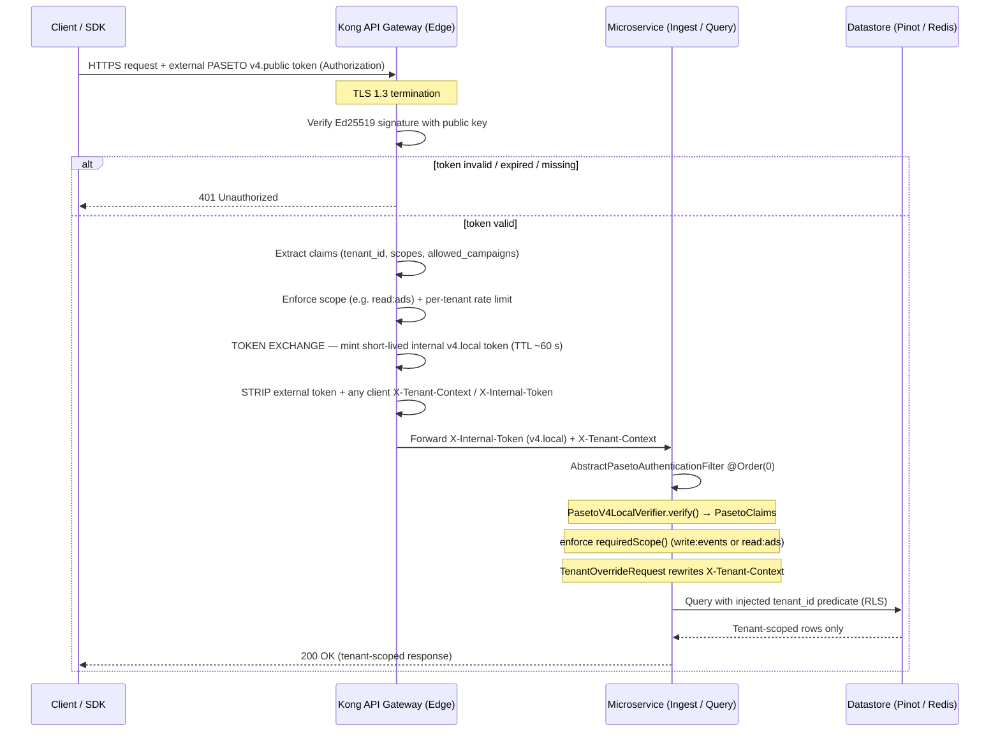

# Authentication & Authorization: Edge-Validated PASETO, Header-Propagated Trust

> **Status:** Reference architecture + current implementation
> **Last validated:** 2026-06-28 (code review — reflects current codebase)
> **Audience:** Platform engineers, SREs, security reviewers, integrators
> **Related:** `docs/SDD.md` 6 (Multi-Tenancy & Logical Data Isolation)

This document describes, end to end, how requests are authenticated and how
tenant identity flows through the Streaming Insight Platform. The model is
summarised in one phrase:

> **Edge-validated PASETO, header-propagated trust.**

That means: a cryptographic token (**PASETO**) is verified at the **edge
gateway**, which injects a small, sanitized **identity header**
(`X-Tenant-Context`) derived from the verified token. Everything behind the
gateway consumes that uniform header contract and scopes all data access to it.

> **Implementation update (2026-06-25) — Option C (token exchange):** the
> deployed model is now **edge-verify + token-exchange**, which makes the
> "external token never crosses the boundary" guarantee literally true again.
> The edge gateway verifies the external **`v4.public`** token, then **re-mints a
> short-lived internal `v4.local`** token (symmetric XChaCha20 + keyed BLAKE2b)
> carrying the already-validated claims, and forwards *that* on an internal
> header (`X-Internal-Token`). Each service verifies the internal token with a
> shared symmetric key (`shared-security`) and derives the tenant from the
> **verified claims**. The original external token is consumed at the edge and
> never enters the mesh.
>
> **Implementation update (2026-06-28) — shared-security consolidation:** all
> filter logic (token verification, scope enforcement, audit logging,
> `TenantOverrideRequest`) now lives in a single abstract base class
> **`AbstractPasetoAuthenticationFilter`** in `shared-security`. Each HTTP service
> has a thin 4-line subclass that declares only its required scope (`write:events`
> or `read:ads`). `PasetoSecurityConfig` is registered as a **Spring Boot 3.x
> `@AutoConfiguration`** via
> `META-INF/spring/org.springframework.boot.autoconfigure.AutoConfiguration.imports`
> — both services pick up the `PasetoVerifier` bean automatically without any
> `@Import`. The verifier is pluggable via `platform.security.paseto.mode`:
> `local` (Option C, deployed default) or `public` (verify the external token
> directly). When verification is **disabled** (`enabled=false`, local dev),
> services fall back to trusting the gateway-injected `X-Tenant-Context`.

---

## Table of Contents

- [1. Why This Model](#1-why-this-model)
- [2. The Two Trust Zones](#2-the-two-trust-zones)
- [3. End-to-End Request Flow](#3-end-to-end-request-flow)
- [4. The PASETO Token](#4-the-paseto-token)
    - [4.1. Why PASETO over JWT](#41-why-paseto-over-jwt)
    - [4.2. Token Shape & Claims](#42-token-shape--claims)
    - [4.3. Key Management & Rotation](#43-key-management--rotation)
    - [4.4. Token Samples](#44-token-samples)
- [5. Edge Validation (Kong Gateway)](#5-edge-validation-kong-gateway)
- [6. Header Propagation Contract](#6-header-propagation-contract)
- [7. In-Service Enforcement (Current Code)](#7-in-service-enforcement-current-code)
    - [7.1. AbstractPasetoAuthenticationFilter (shared base)](#71-abstractpasetoauthenticationfilter-shared-base)
    - [7.2. Thin Service Subclasses](#72-thin-service-subclasses)
    - [7.3. Fail-Closed Auto-Configuration](#73-fail-closed-auto-configuration)
    - [7.4. Ingestion Service](#74-ingestion-service)
    - [7.5. Insights Query Service](#75-insights-query-service)
- [8. Authorization: Tenant Scoping & Row-Level Security](#8-authorization-tenant-scoping--row-level-security)
- [9. Configuration Reference](#9-configuration-reference)
- [10. Threat Model & Mitigations](#10-threat-model--mitigations)
- [11. Failure Modes & HTTP Semantics](#11-failure-modes--http-semantics)
- [12. Testing Authentication](#12-testing-authentication)
- [13. In-Service Verification (Implemented)](#13-in-service-verification-implemented)
- [14. FAQ](#14-faq)

---

## 1. Why This Model

High-throughput ingestion and low-latency query services should not each pay the
cost of full token cryptography on every request, nor should every team
re-implement token parsing (a common source of security bugs). Instead:

| Goal | How this model achieves it |
| :--- | :--- |
| **Single source of auth truth** | The gateway validates tokens; the verifier logic is also centralized in one reusable `shared-security` module. |
| **Defense-in-depth** | Services re-verify the token in-process (`AbstractPasetoAuthenticationFilter`, `@Order(0)`) — not just a header presence check. |
| **Uniform identity** | Every downstream service sees the same `X-Tenant-Context` contract, always derived from verified claims. |
| **Reduced attack surface** | The raw token is consumed at the edge; in the mesh the verified tenant is the contract, and a forged header is overwritten by `TenantOverrideRequest`. |
| **Fast edge throughput** | PASETO's versioned format skips JWT header-parsing overhead at peak. |
| **DRY filter code** | All auth logic lives in `AbstractPasetoAuthenticationFilter` in `shared-security`; service subclasses declare only their required scope — one place to audit, one place to change. |

---

## 2. The Two Trust Zones

```
        UNTRUSTED ZONE                 │            TRUSTED ZONE
  (public internet, clients)           │      (private mesh / cluster)
                                       │
  ┌─────────────┐  external            │   internal v4.local token
  │  Client/SDK │  v4.public token  ┌──┴───┐  (X-Internal-Token)        ┌───────────────┐
  └─────────────┘ ───────────────►  │ Kong │ ─────────────────────────► │ Microservices │
                  (Authorization)   │ Edge │   + X-Tenant-Context        │ (ingest/query)│
                                    └──┬───┘                             └───────────────┘
   External token verified HERE.      │   External token consumed HERE; a short-lived
   Internal token minted HERE.        │   internal token (re-minted) is what crosses.
```

- **Untrusted zone:** clients present a signed external **`v4.public`** token.
  Nothing is trusted.
- **Trust boundary (the gateway):** verifies the external token, then performs a
  **token exchange** — it mints a short-lived internal **`v4.local`** token
  (symmetric) carrying the verified claims, and forwards it on `X-Internal-Token`.
  The external token is **consumed here and never forwarded**.
- **Trusted zone:** services **verify the internal `v4.local` token** with the
  shared symmetric key and derive the tenant from its claims. (When
  verification is disabled for local dev, they fall back to trusting
  `X-Tenant-Context`, which the gateway still strips/injects — see 6.)

---

## 3. End-to-End Request Flow



**Plain-language walkthrough:**

1. Client calls the public endpoint over **TLS 1.3** with an external `v4.public` token.
2. Kong **verifies the Ed25519 signature**. Invalid/expired/missing → **401**.
3. Kong **extracts claims**, enforces scope and per-tenant rate limit.
4. Kong **mints a short-lived internal `v4.local` token** (token exchange), strips
   the external token and any client-supplied headers, forwards the internal token on
   `X-Internal-Token`.
5. `AbstractPasetoAuthenticationFilter` (`@Order(0)`) **verifies the `v4.local` token**,
   derives the tenant from verified claims, enforces the service scope, and overwrites
   `X-Tenant-Context`. Missing/invalid → **401/403**.
6. Service queries the datastore with `tenant_id` **forced into the predicate** (RLS).

---

## 4. The PASETO Token

### 4.1. Why PASETO over JWT

| Security vector | Legacy JWT | PASETO `v4.public` |
| :--- | :--- | :--- |
| **Algorithm confusion** (`RS256`→`HS256`) | Vulnerable — attacker can swap the `alg` header. | Immune — `v4.public` is fixed to **Ed25519**; no `alg` field. |
| **`alg: none`** | Historically accepted by many parsers. | Impossible — signatures are mandatory. |
| **Weak crypto agility** | Allows SHA-1/short keys via config. | Primitives locked per version — not configurable. |
| **Validation performance** | Parse arbitrary JSON header first. | Version string (`v4.public.`) short-circuits parsing. |

### 4.2. Token Shape & Claims

The `PasetoClaims` record (`shared-security`) is the typed carrier for all claims
from both token flavours:

```java
// com.java.security.paseto.PasetoClaims
@JsonIgnoreProperties(ignoreUnknown = true)
public record PasetoClaims(
        @JsonProperty("tenant_id")          String       tenantId,
        @JsonProperty("scopes")             List<String> scopes,
        @JsonProperty("allowed_campaigns")  List<String> allowedCampaigns,
        @JsonProperty("iss")  String issuer,
        @JsonProperty("aud")  String audience,
        @JsonProperty("sub")  String subject,
        @JsonProperty("exp")  String expiration,
        @JsonProperty("nbf")  String notBefore,
        @JsonProperty("iat")  String issuedAt,
        @JsonProperty("jti")  String tokenId) {

    /** True if the token grants the given scope (e.g. "read:ads"). */
    public boolean hasScope(String scope) {
        return scopes != null && scopes.contains(scope);
    }

    /**
     * True if the token may access the campaign.
     * Absent/empty allowed_campaigns = no campaign restriction (tenant scoping still applies).
     */
    public boolean canAccessCampaign(String campaignId) {
        return allowedCampaigns == null
                || allowedCampaigns.isEmpty()
                || allowedCampaigns.contains(campaignId);
    }
}
```

Conceptual decoded payload:

```json
{
  "tenant_id":         "walmart_us",
  "scopes":            ["read:ads"],
  "allowed_campaigns": ["cmp_spring_99a", "cmp_singles_day"],
  "iss":               "auth.platform.internal",
  "aud":               "event-analysis",
  "iat":               "2026-06-28T10:00:00Z",
  "nbf":               "2026-06-28T10:00:00Z",
  "exp":               "2026-06-28T10:15:00Z",
  "jti":               "tok_a3f2b1c4d5e6f789"
}
```

| Claim | Purpose |
| :--- | :--- |
| `tenant_id` | Retailer identity → becomes `X-Tenant-Context`. |
| `scopes` | Coarse permissions (`read:ads`, `write:events`). Enforced in `AbstractPasetoAuthenticationFilter`. |
| `allowed_campaigns` | Optional fine-grained allow-list. Absent/empty = no restriction. Enforced by `InsightsRequestValidator`. |
| `iss` / `aud` | Issuer/audience binding — reject foreign tokens. |
| `iat` / `nbf` / `exp` | Timestamps — keep short-lived (≈15 min external, ≈60 s internal). |
| `jti` | Unique token id — available for revocation denylist (roadmap). |

### 4.3. Key Management & Rotation

- **Asymmetric keys (external):** auth server signs with **Ed25519 private key**; Kong
  verifies with the **public key** only. Services hold no keys.
- **Symmetric key (internal, Option C):** gateway and services share a **32-byte secret**
  (`PASETO_LOCAL_KEY`). Delivered via External Secrets / Vault — **never committed to git**.
- **Rotation:** distribute the new symmetric key to both gateway and services simultaneously.
  The short TTL (~60 s) means the overlap window is tiny. Use a `kid` footer to disambiguate.
- **Blast radius:** leaked public key is harmless. Leaked symmetric key → rotate immediately.

### 4.4. Token Samples

#### External `v4.public` token — Client → Kong Gateway

The payload is **readable** (signed, not encrypted).
Wire format: `v4.public.<base64url(message_bytes || ed25519_sig_64B)>`

```
# Illustrative sample — NOT cryptographically valid; for format reference only.
v4.public.eyJ0ZW5hbnRfaWQiOiJ3YWxtYXJ0X3VzIiwic2NvcGVzIjpbInJlYWQ6YWRzIl0s
ImFsbG93ZWRfY2FtcGFpZ25zIjpbImNtcF9zcHJpbmdfOTlhIiwiY21wX3NpbmdsZXNfZGF5Il0s
Imlzcyc6ImF1dGgucGxhdGZvcm0uaW50ZXJuYWwiLCJhdWQiOiJldmVudC1hbmFseXNpcyIsImlh
dCI6IjIwMjYtMDYtMjhUMTA6MDA6MDBaIiwiZXhwIjoiMjAyNi0wNi0yOFQxMDoxNTowMFoiLCJq
dGkiOiJ0b2tfYTNmMmIxYzRkNWU2Zjc4OSJ9T9K8rZjQvXmNpLsYwBuCdEhFgIaJkMoPlRnSqTu
```

Decoded message (before the 64-byte Ed25519 signature):

```json
{
  "tenant_id":         "walmart_us",
  "scopes":            ["read:ads"],
  "allowed_campaigns": ["cmp_spring_99a", "cmp_singles_day"],
  "iss":               "auth.platform.internal",
  "aud":               "event-analysis",
  "iat":               "2026-06-28T10:00:00Z",
  "nbf":               "2026-06-28T10:00:00Z",
  "exp":               "2026-06-28T10:15:00Z",
  "jti":               "tok_a3f2b1c4d5e6f789"
}
```

> This token is verified by Kong via `PasetoV4PublicVerifier` (Ed25519 + PAE encoding).
> It **never enters the service mesh** — Kong consumes it and mints an internal token.

---

#### Internal `v4.local` token — Kong Gateway → Microservices via `X-Internal-Token`

The payload is **fully encrypted** (XChaCha20 + keyed BLAKE2b MAC).
Wire format: `v4.local.<base64url(nonce_24B || ciphertext || tag_32B)>`

```
# Illustrative sample — NOT cryptographically valid; for format reference only.
v4.local.QkFCQkFCQkFCQkFCQkFCQkFCQkFCQkFCQkFCQkFCQkE1Mz4yMTA0QUJDREVGR0hJSktM
TU5PUFFSU1RVVldYWVphYmNkZWZnaGlqa2xtbm9wcXJzdHV2d3h5ejAxMjM0NTY3ODlBQkNERUZH
```

When decrypted (visible only to services holding `PASETO_LOCAL_KEY`):

```json
{
  "tenant_id":         "walmart_us",
  "scopes":            ["read:ads"],
  "allowed_campaigns": ["cmp_spring_99a", "cmp_singles_day"],
  "iss":               "edge",
  "aud":               "event-analysis",
  "iat":               "2026-06-28T10:00:00Z",
  "nbf":               "2026-06-28T10:00:00Z",
  "exp":               "2026-06-28T10:01:00Z"
}
```

> **Key differences from the external token:**
> - `iss` is `"edge"` (the gateway, not the original auth server).
> - `exp` is **60 seconds** from `iat` — tiny TTL by design.
> - `jti` is omitted to keep the payload minimal.
> - The payload is **completely opaque on the wire** — only a holder of `PASETO_LOCAL_KEY`
    >   can decrypt and inspect it. PASETO-unaware tooling sees only random-looking bytes.

This token is verified in-process by `PasetoV4LocalVerifier` on every request
(decrypt → validate `exp`/`nbf`/`iss`/`aud` → return `PasetoClaims`).

---

#### Minting an internal token — edge / test code

`PasetoV4LocalIssuer` in `shared-security` is the reference implementation of the
gateway token-exchange step. Used in production by the Kong plugin and directly in tests:

```java
// After verifying the external v4.public token at the edge:
PasetoV4LocalIssuer issuer = new PasetoV4LocalIssuer(
        sharedKey,           // 32-byte hex/base64 — from PASETO_LOCAL_KEY K8s Secret
        "edge",              // iss
        "event-analysis");   // aud

String internalToken = issuer.issue(
        "walmart_us",                              // verified tenant_id
        List.of("read:ads"),                       // granted scopes
        List.of("cmp_spring_99a"),                 // allowed_campaigns (empty = no restriction)
        Duration.ofSeconds(60));                   // tiny TTL

// Forward downstream as:
//   X-Internal-Token: v4.local.<encrypted>
//   X-Tenant-Context: walmart_us
```

---

#### `curl` smoke tests

```bash
# ── Local dev (paseto.enabled=false) ─────────────────────────────────────────
# Trust gateway-injected X-Tenant-Context directly.

# Ingest event
curl -s -X POST http://localhost:8080/api/v1/events \
  -H 'Content-Type: application/json' \
  -H 'X-Tenant-Context: walmart_us' \
  -d '{"eventId":"e1","userId":"u1","sessionId":"s1","eventType":"CLICK"}'
# → 202 Accepted

# Query clicks
curl -s -H 'X-Tenant-Context: walmart_us' \
  'http://localhost:8083/api/v1/campaigns/cmp_spring_99a/clicks?grain=hour'
# → 200 OK

# ── Staging / prod (paseto.enabled=true, mode=local) ─────────────────────────
# X-Internal-Token must be a valid v4.local token minted by the gateway.
curl -s \
  -H 'X-Internal-Token: v4.local.<gateway-minted-token>' \
  -H 'X-Tenant-Context: walmart_us' \
  'http://localhost:8083/api/v1/campaigns/cmp_spring_99a/clicks?grain=hour'
# → 200 OK

# Missing token → 401
curl -s -i 'http://localhost:8083/api/v1/campaigns/cmp_spring_99a/clicks?grain=hour'
# → HTTP/1.1 401   {"error":"Invalid or missing authentication token"}

# Token present but wrong scope (write:events on query service) → 403
# → HTTP/1.1 403   {"error":"Missing required scope: read:ads"}
```

---

## 5. Edge Validation (Kong Gateway)

The gateway is the **policy enforcement point (PEP)**. On every request it:

1. **Terminates TLS 1.3** and accepts the external PASETO token (in the `Authorization` header).
2. **Verifies** the external `v4.public` Ed25519 signature with `PASETO_PUBLIC_KEY`.
3. **Validates claims:** `exp` not passed, `iss`/`aud` match, required `scope` present for
   the route (`read:ads` for queries, `write:events` for ingestion).
4. **Applies per-tenant rate limiting** (token-bucket, keyed by `tenant_id`).
5. **Token exchange (Option C):** mints a short-lived internal **`v4.local`** token
   with the verified claims and **consumes** the external token (does not forward it).
6. **Sanitizes + injects headers:** strips all inbound `X-Internal-Token` and
   `X-Tenant-Context`, then injects the minted internal token + tenant.
7. **Forwards** or returns **401/403/429**.

---

## 6. Header Propagation Contract

| Header | Set by | Trusted by services? | Notes |
| :--- | :--- | :--- | :--- |
| `Authorization` (external `v4.public`) | Client | ❌ Never reaches services | Verified + **consumed** at the edge; not forwarded. |
| `X-Internal-Token` (internal `v4.local`) | **Gateway only** | ✅ Verified in-service | Short-lived; verified by `AbstractPasetoAuthenticationFilter`. |
| `X-Tenant-Context` | **Gateway only** | ✅ (fast contract) | Overwritten in-service from verified claims via `TenantOverrideRequest`. |

**Critical anti-spoofing rules:**

1. Gateway **does not forward** the external `Authorization` token.
2. Gateway **unconditionally strips** inbound `X-Tenant-Context` and `X-Internal-Token`
   from the client before injecting its own.
3. `TenantOverrideRequest` (inner class of `AbstractPasetoAuthenticationFilter`) **overwrites**
   `X-Tenant-Context` from the verified `tenant_id` — no downstream component can see a
   client-injected value even if the gateway rule is misconfigured.

---

## 7. In-Service Enforcement (Current Code)

Services implement **two layers** of enforcement:

1. **In-service PASETO verification** (`AbstractPasetoAuthenticationFilter` subclass,
   `@Order(0)`) — when `platform.security.paseto.enabled=true`, verifies the token,
   enforces scope, derives the tenant from **verified claims**, and re-injects a trusted
   `X-Tenant-Context`.
2. **Header presence check** (`TenantContextFilter` / controller) — defense-in-depth floor
   that rejects requests lacking the tenant header even when verification is disabled (local
   dev) or in unit tests that bypass the filter.

### 7.1. AbstractPasetoAuthenticationFilter (shared base)

All common filter logic lives in **one place** — `shared-security`. This is the only class
that implements verification, audit logging, and header rewriting:

```java
// com.java.security.paseto.AbstractPasetoAuthenticationFilter  (shared-security)
public abstract class AbstractPasetoAuthenticationFilter extends OncePerRequestFilter {

    /** Request attribute key — controllers read PasetoClaims from here. */
    public static final String CLAIMS_ATTRIBUTE = "pasetoClaims";

    private static final Logger AUDIT = LoggerFactory.getLogger("SECURITY_AUDIT");
    private static final String TENANT_HEADER = "X-Tenant-Context";

    private final PasetoVerifier verifier;   // null when auth is disabled (local dev)
    private final PasetoProperties props;

    protected AbstractPasetoAuthenticationFilter(
            @Nullable PasetoVerifier verifier, PasetoProperties props) {
        this.verifier = verifier;
        this.props    = props;
    }

    /** Service-specific scope declared by each subclass. */
    protected abstract String requiredScope();

    @Override
    protected boolean shouldNotFilter(HttpServletRequest request) {
        // Bypass when disabled (local dev) or for health/readiness probes.
        return verifier == null || request.getRequestURI().startsWith("/actuator");
    }

    @Override
    protected void doFilterInternal(HttpServletRequest request,
                                    HttpServletResponse response,
                                    FilterChain filterChain) throws ServletException, IOException {
        String token = request.getHeader(props.getTokenHeader()); // e.g. X-Internal-Token
        try {
            PasetoClaims claims = verifier.verify(token);         // MAC/sig + exp/nbf/iss/aud

            if (claims.tenantId() == null || claims.tenantId().isBlank()) {
                AUDIT.warn("event=auth_denied reason=missing_tenant path={}", request.getRequestURI());
                deny(response, HttpServletResponse.SC_UNAUTHORIZED, "Token missing tenant_id");
                return;
            }
            if (!claims.hasScope(requiredScope())) {
                AUDIT.warn("event=authz_denied reason=missing_scope tenant={} path={}",
                        claims.tenantId(), request.getRequestURI());
                deny(response, HttpServletResponse.SC_FORBIDDEN,
                        "Missing required scope: " + requiredScope());
                return;
            }
            request.setAttribute(CLAIMS_ATTRIBUTE, claims);
            AUDIT.info("event=auth_success tenant={} path={}", claims.tenantId(), request.getRequestURI());
            // Overwrite X-Tenant-Context with the cryptographically-verified value.
            filterChain.doFilter(new TenantOverrideRequest(request, claims.tenantId()), response);

        } catch (PasetoException ex) {
            AUDIT.warn("event=auth_denied reason=invalid_token path={}", request.getRequestURI());
            log.debug("PASETO verification failed: {}", ex.getMessage());
            deny(response, HttpServletResponse.SC_UNAUTHORIZED,
                    "Invalid or missing authentication token");
        }
    }

    // deny() — writes {"error":"<message>"} with the given HTTP status.

    // TenantOverrideRequest (inner HttpServletRequestWrapper):
    //   overrides getHeader("X-Tenant-Context") to always return the verified tenantId,
    //   preventing any client-supplied value from reaching downstream components.
}
```

Key properties:

- **Token is the source of truth.** `TenantOverrideRequest` overwrites `X-Tenant-Context`
  from verified claims — no client-supplied header ever reaches downstream.
- **Scope enforced by the subclass contract.** `requiredScope()` is the only thing each
  service declares — one line.
- **Claims exposed for authorization.** Full `PasetoClaims` placed under `pasetoClaims`
  request attribute for per-campaign checks (see 8).
- **Audit trail.** Every allow/deny written to `SECURITY_AUDIT` logger (OWASP A09).
- **Pass-through when disabled.** `verifier == null` → `shouldNotFilter` returns `true`
  → legacy header-trust path (local dev only).

### 7.2. Thin Service Subclasses

Each HTTP service contains **one 4-line subclass** that only declares its scope:

```java
// ingestion-service: com.java.ingestion.security.PasetoAuthenticationFilter
@Component
@Order(0)
@Slf4j
public final class PasetoAuthenticationFilter extends AbstractPasetoAuthenticationFilter {

    public PasetoAuthenticationFilter(@Nullable PasetoVerifier verifier,
                                      PasetoProperties props) {
        super(verifier, props);
    }

    @Override
    protected String requiredScope() { return "write:events"; }
}
```

```java
// insights-query-service: com.java.query.security.PasetoAuthenticationFilter
@Component
@Order(0)
@Slf4j
public final class PasetoAuthenticationFilter extends AbstractPasetoAuthenticationFilter {

    public PasetoAuthenticationFilter(@Nullable PasetoVerifier verifier,
                                      PasetoProperties props) {
        super(verifier, props);
    }

    @Override
    protected String requiredScope() { return "read:ads"; }
}
```

All verification, audit logging, and `TenantOverrideRequest` are inherited — no duplication
across services. Adding a third service requires only this same 4-line pattern.

### 7.3. Fail-Closed Auto-Configuration

`PasetoSecurityConfig` in `shared-security` is a **Spring Boot 3.x `@AutoConfiguration`**
registered via `AutoConfiguration.imports` — both services pick up the beans automatically
with **no `@Import` required**:

```
# shared-security/src/main/resources/
# META-INF/spring/org.springframework.boot.autoconfigure.AutoConfiguration.imports
com.java.security.paseto.PasetoSecurityConfig
```

```java
// com.java.security.paseto.PasetoSecurityConfig
@AutoConfiguration
@ConditionalOnWebApplication(type = ConditionalOnWebApplication.Type.SERVLET)
@EnableConfigurationProperties(PasetoProperties.class)
@Slf4j
public class PasetoSecurityConfig {

    private static final String MODE_LOCAL = "local";

    /**
     * Returns null when disabled (local dev) — AbstractPasetoAuthenticationFilter
     * then bypasses every request via shouldNotFilter().
     */
    @Bean
    public PasetoVerifier pasetoVerifier(PasetoProperties props) {
        if (!props.isEnabled()) {
            log.warn("PASETO verification DISABLED — local dev mode only.");
            return null;
        }
        Duration skew = Duration.ofSeconds(props.getClockSkewSeconds());
        if (MODE_LOCAL.equalsIgnoreCase(props.getMode())) {
            log.info("PASETO in-service verification enabled (mode=local, v4.local).");
            return new PasetoV4LocalVerifier(
                    props.getLocalKey(), props.getIssuer(), props.getAudience(), skew);
        }
        log.info("PASETO in-service verification enabled (mode=public, v4.public).");
        return new PasetoV4PublicVerifier(
                props.getPublicKey(), props.getIssuer(), props.getAudience(), skew);
    }

    /** Fail-closed guard: refuses to start if PASETO is enabled but the key is missing. */
    @Bean
    public ApplicationRunner pasetoKeyGuard(PasetoProperties props) {
        return args -> {
            if (!props.isEnabled()) return;
            boolean local = MODE_LOCAL.equalsIgnoreCase(props.getMode());
            String key = local ? props.getLocalKey() : props.getPublicKey();
            if (key == null || key.isBlank()) {
                throw new IllegalStateException(
                    "PASETO is enabled (mode=" + props.getMode() + ") but the required key "
                    + (local ? "platform.security.paseto.local-key"
                              : "platform.security.paseto.public-key")
                    + " is missing — refusing to start (fail-closed, OWASP A05/A07).");
            }
        };
    }
}
```

> **`@ConditionalOnWebApplication(SERVLET)`** prevents `PasetoSecurityConfig` from activating
> in non-servlet contexts (e.g. the Flink `stream-processing-engine`) even if `shared-security`
> is transitively on the classpath.
>
> **No `@Import` in consuming services** — Spring Boot 3.x scans `AutoConfiguration.imports`
> automatically at startup. Both `ingestion-service` and `insights-query-service` receive
> `PasetoVerifier` and `PasetoProperties` beans without any explicit wiring code.

### 7.4. Ingestion Service

`TenantContextFilter` (`@Order(1)`) is the defense-in-depth presence check that runs
**after** the PASETO verification filter:

```java
// com.java.ingestion.security.TenantContextFilter
@Component
@Order(1)
public final class TenantContextFilter extends OncePerRequestFilter {

    public static final String TENANT_HEADER    = "X-Tenant-Context";
    public static final String TENANT_ATTRIBUTE = "tenantContext";
    private static final String INGEST_PATH_PREFIX = "/api/v1/events";   // ← /api prefix

    @Override
    protected void doFilterInternal(HttpServletRequest request,
                                    HttpServletResponse response,
                                    FilterChain filterChain) throws ServletException, IOException {
        if (request.getRequestURI().startsWith(INGEST_PATH_PREFIX)) {
            String tenant = request.getHeader(TENANT_HEADER); // verified value when auth is on
            if (tenant == null || tenant.isBlank()) {
                response.setStatus(HttpServletResponse.SC_UNAUTHORIZED);
                response.setContentType("application/json");
                response.getWriter().write(
                        "{\"error\":\"Missing " + TENANT_HEADER + ". Authentication required.\"}");
                return;
            }
            request.setAttribute(TENANT_ATTRIBUTE, tenant);
        }
        filterChain.doFilter(request, response);
    }
}
```

- Path prefix is **`/api/v1/events`** (not `/v1/events`).
- When auth is enabled, `tenant` is the **verified value** that `TenantOverrideRequest`
  injected — `TenantContextFilter` just confirms its presence.
- `IngestController` also re-checks the header — intentional redundancy so the rule holds
  even when filters aren't in the chain (unit tests).

### 7.5. Insights Query Service

Every read endpoint binds `X-Tenant-Context` and the verified `PasetoClaims`, then
delegates all validation and per-campaign authorization to `InsightsRequestValidator`:

```java
// AdInsightsController.java (thin controller)
@GetMapping("/{campaignId}/clicks")
public ResponseEntity<CampaignMetricResponse> clicks(
        @PathVariable String campaignId,
        @RequestParam(required = false) String from,
        @RequestParam(required = false) String to,
        @RequestParam(defaultValue = "hour") String grain,
        @RequestParam(required = false) String placement,
        @RequestHeader(value = "X-Tenant-Context", required = false) String tenant,
        @RequestAttribute(value = PasetoAuthenticationFilter.CLAIMS_ATTRIBUTE, required = false)
        PasetoClaims claims) {
    return respond(tenant, claims, campaignId, "CLICK", from, to, grain, placement);
}
```

`InsightsServiceImpl` delegates to `InsightsRequestValidator` which enforces:

- **Tenant presence** — `null`/blank → **401**
- **Identifier format** (`campaignId`, `placement`) — regex allow-list → **400**
- **Grain allow-list** (`hour`, `day`, `week`) → **400**
- **Per-campaign authorization** — `claims.canAccessCampaign(campaignId)` → **403**

The `read:ads` scope is enforced earlier, in `AbstractPasetoAuthenticationFilter`,
before the controller is ever reached.

---

## 8. Authorization: Tenant Scoping & Row-Level Security

Authentication answers *who*; authorization answers *what they may see*. The query layer
injects the verified `tenant_id` into **every** compiled query so cross-tenant reads are
structurally impossible:

```sql
-- Client calls: GET /api/v1/campaigns/cmp_456/clicks  (X-Tenant-Context: walmart_us)
-- Service compiles and sends to Pinot:
SELECT COUNT(*)
FROM   shopping_events
WHERE  campaign_id = 'cmp_456'
  AND  tenant_id   = 'walmart_us';   -- injected from verified claims (RLS predicate)
```

- `tenant_id` predicate is **never** taken from client input — only from verified claims.
- `allowed_campaigns` is enforced in `InsightsRequestValidator`:
  `claims.canAccessCampaign(campaignId)` → **403** for out-of-policy campaigns.
- `read:ads` scope is required by `AbstractPasetoAuthenticationFilter` → **403** if absent.
- Responses echo `tenantId` so integrators can assert correct scoping.

This is the platform's **logical zero-trust isolation** (architecture 6.1): identity enforced
at the gateway and again at the data predicate.

---

## 9. Configuration Reference

`PasetoProperties` is **auto-configured** from `shared-security` — services need no local
copy and no `@Import`. Binds `platform.security.paseto.*`.

**Staging / prod** (`application-prod.yml` — same shape for both services):

```yaml
platform:
  security:
    paseto:
      enabled: true
      mode: local                       # Option C: verify internal v4.local token
      local-key: ${PASETO_LOCAL_KEY:}   # 32-byte key (hex/base64), from K8s Secret
      issuer: ${PASETO_ISSUER:edge}
      audience: ${PASETO_AUDIENCE:event-analysis}
      token-header: ${PASETO_TOKEN_HEADER:X-Internal-Token}
      clock-skew-seconds: 30
```

**Dev environment** (`application-dev.yml`) — `mode: public` (external token passes through):

```yaml
platform:
  security:
    paseto:
      enabled: true
      mode: public
      public-key: ${PASETO_PUBLIC_KEY:}
      token-header: ${PASETO_TOKEN_HEADER:Authorization}
      clock-skew-seconds: 60
```

**Local dev** (`application-local.yml`) — verification disabled:

```yaml
platform:
  security:
    paseto:
      enabled: false   # local dev only — trust gateway-injected X-Tenant-Context
```

> **Java code defaults:** `PasetoProperties` defaults to `mode = "public"` and
> `tokenHeader = "Authorization"`. Those defaults are **never used in a running deployment**
> because every profile YAML explicitly sets both values. They are a safety-net only.

| Setting | Meaning | Source |
| :--- | :--- | :--- |
| `platform.security.paseto.enabled` | Toggle in-service verification. `false` = local-dev header-trust. | per-profile YAML |
| `platform.security.paseto.mode` | `local` (Option C, verify `v4.local`) or `public` (verify `v4.public`). | per-profile YAML |
| `platform.security.paseto.local-key` | 32-byte symmetric key (hex/base64). **Same key used by the gateway issuer.** | K8s Secret `PASETO_LOCAL_KEY` |
| `platform.security.paseto.public-key` | Ed25519 public key (used when `mode=public`). | K8s Secret `PASETO_PUBLIC_KEY` |
| `platform.security.paseto.issuer` | Expected `iss`; blank = not enforced. | per-profile YAML |
| `platform.security.paseto.audience` | Expected `aud`; blank = not enforced. | per-profile YAML |
| `platform.security.paseto.token-header` | Header carrying the token (`X-Internal-Token` for local mode, `Authorization` for public mode). | per-profile YAML |
| `platform.security.paseto.clock-skew-seconds` | Allowed skew for `exp`/`nbf` (default 60 s; 30 s in prod). | per-profile YAML |

> **Fail-closed:** when `enabled=true` and the key for the active `mode` is blank,
> `pasetoKeyGuard` throws `IllegalStateException` at startup — no silent auth bypass.

**Secret delivery:** `PASETO_LOCAL_KEY` (or `PASETO_PUBLIC_KEY`) is in the `app-secrets`
Kubernetes Secret, synced by External Secrets / Vault — **never in git or ConfigMaps**.

---

## 10. Threat Model & Mitigations

| Threat | Vector | Mitigation |
| :--- | :--- | :--- |
| **Token forgery** | Craft a fake token. | Ed25519 sig verified at edge; internal token BLAKE2b MAC verified in-service (`PasetoV4LocalVerifier`). Private key / shared key never leave vault. |
| **Algorithm confusion / `alg:none`** | Swap algorithm to bypass verify. | PASETO fixes algorithm per version; verifier hard-rejects anything not starting with `v4.local.` or `v4.public.`. |
| **Header spoofing** | Client sends its own `X-Tenant-Context`. | Gateway strips it; `TenantOverrideRequest` in `AbstractPasetoAuthenticationFilter` overwrites it in-service from verified claims. |
| **Replay** | Reuse a captured token. | External: ~15 min `exp`; internal: ~60 s TTL. TLS prevents capture. Optional `jti` denylist (roadmap). |
| **Cross-tenant data access** | Query another tenant's campaign. | `tenant_id` forced into every query predicate (RLS). |
| **Campaign over-reach** | Query a campaign outside policy. | `allowed_campaigns` enforced by `InsightsRequestValidator` → **403**. |
| **Missing required scope** | Read without `read:ads` or ingest without `write:events`. | Enforced in `AbstractPasetoAuthenticationFilter.doFilterInternal` → **403**. |
| **Silent auth bypass** | Deploy with auth on but no key. | `pasetoKeyGuard` `ApplicationRunner` refuses to start. |
| **Noisy neighbor / abuse** | One tenant floods the API. | Per-tenant token-bucket at the edge + per-tenant Redis rate limiter in ingestion-service. |
| **Key compromise** | Leaked signing or symmetric key. | Short token TTL + rapid key rotation (`kid` footer for overlap); revoke signer. |
| **MITM** | Intercept traffic. | TLS 1.3 at the edge; mesh mTLS internally. |
| **Non-servlet activation** | `shared-security` loaded in Flink. | `@ConditionalOnWebApplication(SERVLET)` prevents `PasetoSecurityConfig` from activating in non-servlet contexts. |

---

## 11. Failure Modes & HTTP Semantics

| Condition | Where caught | Response |
| :--- | :--- | :--- |
| Missing/invalid/expired token | Gateway **and** `AbstractPasetoAuthenticationFilter` | `401 Unauthorized` |
| Token signature/MAC/`iss`/`aud`/`exp` invalid | `AbstractPasetoAuthenticationFilter` | `401 Unauthorized` |
| Valid token, missing `read:ads` scope (query service) | `AbstractPasetoAuthenticationFilter` | `403 Forbidden` |
| Valid token, missing `write:events` scope (ingestion) | `AbstractPasetoAuthenticationFilter` | `403 Forbidden` |
| Tenant over rate limit | Gateway + `TenantRateLimiter` (ingestion) | `429 Too Many Requests` |
| Missing/blank `X-Tenant-Context` (defense-in-depth) | `TenantContextFilter` / controller | `401 Unauthorized` |
| Querying a campaign outside `allowed_campaigns` | `InsightsRequestValidator` | `403 Forbidden` |
| Malformed `campaignId`/`placement`/`grain` | `InsightsRequestValidator` | `400 Bad Request` |
| Auth enabled but key missing | `pasetoKeyGuard` at startup | App refuses to start |

Error body shapes:

```json
{ "error": "Invalid or missing authentication token" }
{ "error": "Missing required scope: write:events" }
{ "error": "Missing required scope: read:ads" }
{ "error": "Missing X-Tenant-Context. Authentication required." }
```

---

## 12. Testing Authentication

Existing tests assert the contract directly (no gateway needed):

- **Ingestion** (`IngestControllerTest`): "Rejects ingest without `X-Tenant-Context` header
  (401)"; happy-path requests pass `.header("X-Tenant-Context", "walmart_us")`.
- **Insights** (`AdInsightsControllerTest`): requests include
  `.header("X-Tenant-Context", "walmart_us")` and assert tenant-scoped output.
- **PASETO crypto** (`PasetoV4PublicVerifierTest` 5 tests + `PasetoV4LocalVerifierTest`
  6 tests in `shared-security`): round-trip, tamper, expiry, wrong-key, wrong-issuer.

**Suggested additional cases (open):**

1. Blank header (`X-Tenant-Context: ""`) → 401.
2. Two tenants, same campaign id → each sees only its own counts (RLS).
3. Tampered token → 401 at the in-service verifier (HTTP-layer integration test).
4. Token without `write:events` scope → 403 at the ingestion filter.
5. Token without `read:ads` scope → 403 at the insights filter.
6. Campaign outside `allowed_campaigns` → 403 via `InsightsRequestValidator`.

---

## 13. In-Service Verification (Implemented)

All auth code lives in `shared-security` and is auto-configured into both HTTP services
via Spring Boot 3.x `AutoConfiguration.imports`. No service contains auth logic beyond
a one-method scope declaration.

**What was delivered:**

1. **`PasetoClaims` record** — typed carrier for all token claims (`tenant_id`, `scopes`,
   `allowed_campaigns`, `iss`/`aud`/`sub`/`exp`/`nbf`/`iat`/`jti`). Helper methods:
   `hasScope(String)`, `canAccessCampaign(String)`, `expirationInstant()`.

2. **`PasetoVerifier` interface** — single `verify(String token)` method; injected as
   `@Nullable` into the filter (`null` = disabled = bypass).

3. **Crypto implementations:**
    - **`PasetoV4PublicVerifier`** — JDK 21 native `Ed25519`; verifies the external `v4.public`
      token (PAE encoding, 64-byte signature stripped from body).
    - **`PasetoV4LocalVerifier`** — decrypts and authenticates the internal `v4.local` token
      via `PasetoV4Local` (XChaCha20 + keyed BLAKE2b). Accepts optional `implicitAssertion`.
    - **`PasetoV4LocalIssuer`** — mints internal `v4.local` tokens; used by the Kong plugin /
      token-exchange service at the edge, and directly in tests.
    - **`ClaimsValidator`** — centralizes `exp`/`nbf`/`iss`/`aud` validation with clock-skew
      so both verifiers cannot drift independently.

4. **`AbstractPasetoAuthenticationFilter`** — abstract `OncePerRequestFilter` (`@Order(0)`)
   in `shared-security`. Contains: `CLAIMS_ATTRIBUTE` constant, `SECURITY_AUDIT` logger,
   full `doFilterInternal`, `shouldNotFilter`, `deny()`, and `TenantOverrideRequest` inner
   class. Single abstract method: `requiredScope()`.

5. **Thin service subclasses** — each HTTP service has a `@Component @Order(0)` subclass
   that only implements `requiredScope()`:
    - `ingestion-service` → `"write:events"`
    - `insights-query-service` → `"read:ads"`

6. **`PasetoSecurityConfig`** — `@AutoConfiguration` + `@ConditionalOnWebApplication(SERVLET)`
    + `@EnableConfigurationProperties(PasetoProperties.class)`. Registered via
      `META-INF/spring/org.springframework.boot.autoconfigure.AutoConfiguration.imports`
      (Spring Boot 3.x — no `@Import` in consuming services). Contains `pasetoVerifier` bean
      (mode-aware) and `pasetoKeyGuard` fail-closed `ApplicationRunner`.

7. **`PasetoProperties`** — single `@ConfigurationProperties(prefix = "platform.security.paseto")`
   shared across all services: `enabled`, `mode`, `publicKey`, `localKey`, `issuer`,
   `audience`, `tokenHeader`, `clockSkewSeconds`.

8. **Authorization** — `write:events` scope enforced in ingestion filter; `read:ads` scope
   enforced in insights filter; `allowed_campaigns` enforced per-campaign in
   `InsightsRequestValidator`.

**Gateway token-exchange reference** (`PasetoV4LocalIssuer` — Kong plugin / tests):

```java
// At the edge, after verifying the external v4.public token:
PasetoV4LocalIssuer issuer = new PasetoV4LocalIssuer(SHARED_KEY, "edge", "event-analysis");
String internal = issuer.issue(
        verified.tenantId(),
        verified.scopes(),
        verified.allowedCampaigns(),
        Duration.ofSeconds(60));   // tiny TTL
// forward downstream as: X-Internal-Token: <internal>
```

**Still open (roadmap):**

- **`jti` revocation** — optional Redis denylist; `jti` claim already parsed in `PasetoClaims`.
- **Implicit assertions** — `PasetoV4LocalVerifier` already accepts `implicitAssertion`;
  bind to route/channel to stop token relay between services.
- **Symmetric key rotation** — `kid` footer to disambiguate keys during overlap window.
- **HTTP integration tests** — end-to-end filter chain tests with a real minted `v4.local` token.

---

## 14. FAQ

**Q: Do the microservices verify the PASETO token?**
> Yes (when `enabled=true`, the deployed default). In **`mode=local`** each service verifies
> the gateway-minted internal `v4.local` token via `AbstractPasetoAuthenticationFilter` +
> `PasetoV4LocalVerifier` and derives the tenant from verified claims. Only in local dev
> (`enabled=false`) do services fall back to trusting the gateway-injected `X-Tenant-Context`.

**Q: Does the external token reach the services?**
> No. In Option C the gateway **consumes** the external `v4.public` token and re-mints a
> short-lived `v4.local` token (`X-Internal-Token`). The external token never enters the mesh.

**Q: Why is the filter an abstract class rather than duplicated in each service?**
> DRY + single audit point. All 130+ lines of filter logic live in `AbstractPasetoAuthenticationFilter`
> in `shared-security`. Adding a third HTTP service requires only a 4-line subclass. No risk
> of the two service filters drifting apart.

**Q: What stops a client from sending its own `X-Internal-Token` / `X-Tenant-Context`?**
> The gateway strips both inbound headers before injecting its own. In-service,
> `AbstractPasetoAuthenticationFilter` **cryptographically verifies** `X-Internal-Token`
> with the shared key — a forged internal token fails the BLAKE2b MAC check. `TenantOverrideRequest`
> then overwrites `X-Tenant-Context` from the verified claims.

**Q: Why does `PasetoSecurityConfig` use `@AutoConfiguration` instead of `@Configuration`?**
> Spring Boot 3.x auto-configuration via `AutoConfiguration.imports` is the correct mechanism
> for library auto-wiring. With `@Configuration` each service would need an explicit `@Import`.
> With `@AutoConfiguration` + the imports file, both services pick up `PasetoVerifier` and
> `PasetoProperties` automatically as long as `shared-security` is on the classpath and the
> app is a servlet web application.

**Q: Where does the public key / shared key live?**
> In the `app-secrets` Kubernetes Secret (`PASETO_LOCAL_KEY` or `PASETO_PUBLIC_KEY`),
> synced by External Secrets / Vault. Never in git or ConfigMaps.

**Q: Why not JWT?**
> To eliminate algorithm-confusion and `alg:none` attacks and to validate faster at the edge.
> PASETO removes the dangerous configurability of JWT.

**Q: How is one tenant prevented from reading another's data?**
> The verified `tenant_id` is injected as a mandatory predicate into every datastore query
> (Row-Level Security). Tenant id is never taken from client input.

**Q: How are tokens kept from being replayed?**
> Short expiry (~15 min external, ~60 s internal) plus TLS. An optional `jti` denylist can
> be added for explicit revocation.
