# System Design Document (SDD)
## Real-Time Streaming Insight Platform

> **Version:** 1.0 · **Date:** 2026-06-26 · **Status:** Current implementation
> **Audience:** Platform engineers, architects, SREs, tech leads
> **Related docs:** `docs/AUTHENTICATION.md`

---

## Table of Contents

- [1. Executive Summary](#1-executive-summary)
- [2. High-Level Design (HLD)](#2-high-level-design-hld)
  - [2.1. System Context](#21-system-context)
  - [2.2. Component Architecture](#22-component-architecture)
  - [2.3. Data Flow — Write Path](#23-data-flow--write-path)
  - [2.4. Data Flow — Read Path](#24-data-flow--read-path)
  - [2.5. Data Flow — Reconciliation Path](#25-data-flow--reconciliation-path)
  - [2.6. Multi-Region Topology](#26-multi-region-topology)
  - [2.7. Technology Stack Rationale](#27-technology-stack-rationale)
- [3. Database Schemas](#3-database-schemas)
  - [3.1. Kafka Wire Schema (Avro)](#31-kafka-wire-schema-avro)
  - [3.2. Apache Pinot Schema](#32-apache-pinot-schema)
  - [3.3. Redis Key Schema](#33-redis-key-schema)
  - [3.4. Iceberg / Parquet Cold Schema](#34-iceberg--parquet-cold-schema)
- [4. Low-Level Design (LLD)](#4-low-level-design-lld)
  - [4.1. ingestion-service](#41-ingestion-service)
  - [4.2. stream-processing-engine](#42-stream-processing-engine)
  - [4.3. insights-query-service](#43-insights-query-service)
  - [4.4. shared-model](#44-shared-model)
  - [4.5. shared-security](#45-shared-security)
- [5. API Contracts](#5-api-contracts)
  - [5.1. Ingestion API](#51-ingestion-api)
  - [5.2. Campaign Insights API](#52-campaign-insights-api)
  - [5.3. Reconciliation API](#53-reconciliation-api)
- [6. Algorithms & Core Logic](#6-algorithms--core-logic)
  - [6.1. Stream Deduplication](#61-stream-deduplication)
  - [6.2. Sessionized Attribution Join](#62-sessionized-attribution-join)
  - [6.3. Tiered Query Routing](#63-tiered-query-routing)
  - [6.4. PASETO Token Exchange (Option C)](#64-paseto-token-exchange-option-c)
  - [6.5. Reconciliation Algorithm](#65-reconciliation-algorithm)
- [7. Security Design](#7-security-design)
  - [7.1. Authentication Flow](#71-authentication-flow)
  - [7.2. Multi-Tenant Isolation Matrix](#72-multi-tenant-isolation-matrix)
- [8. Scalability & Fault Tolerance](#8-scalability--fault-tolerance)
  - [8.1. Auto-Scaling Strategy](#81-auto-scaling-strategy)
  - [8.2. Flink Fault Tolerance](#82-flink-fault-tolerance)
- [9. Observability](#9-observability)
  - [9.1. SLIs and SLOs](#91-slis-and-slos)
  - [9.2. Metrics Catalogue](#92-metrics-catalogue)
- [10. Trade-offs & Design Decisions](#10-trade-offs--design-decisions)

---

## 1. Executive Summary

The platform is a **multi-tenant, real-time streaming analytics system** for ad-network retailers (Walmart, Target, etc.). It ingests billions of ad-interaction events per day, processes them with stateful stream operators (deduplication, attribution), and serves sub-second campaign metric queries across a **three-tier storage hierarchy** (Redis → Pinot → Iceberg/Trino).

**Core capabilities:**

| Capability | Target |
|:-----------|:-------|
| Sustained ingest throughput | 150 K events/sec |
| Peak ingest throughput (Black Friday) | 5 M events/sec |
| End-to-end freshness (P99) | < 3 seconds |
| Campaign query latency (Redis tier, P99) | < 7.5 ms |
| Campaign query latency (Pinot tier, P99) | < 85 ms |
| Daily event volume | ~13 billion events |
| Concurrency | 25 000 simultaneous API requests |

**Architectural pattern:** CQRS + Lambda hybrid — write and read paths are fully separated, with an exactly-once stateful stream core and a periodic reconciliation layer for financial accuracy.

---

## 2. High-Level Design (HLD)

### 2.1. System Context

> Who uses the system, what the system does, and what external systems it depends on.

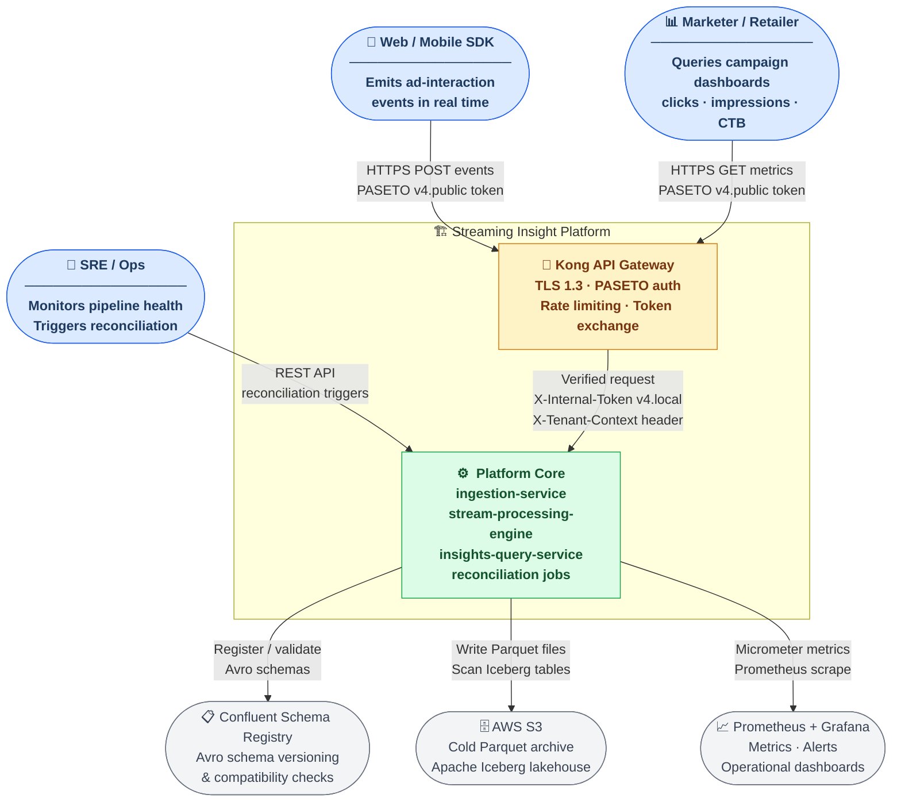
```mermaid
flowchart TB
    %% ── Actors ──────────────────────────────────────────────────────────────
    SDK(["📱 Web / Mobile SDK\n─────────────────\nEmits ad-interaction\nevents in real time"])
    MKT(["📊 Marketer / Retailer\n─────────────────\nQueries campaign dashboards\nclicks · impressions · CTB"])
    SRE(["🔧 SRE / Ops\n─────────────────\nMonitors pipeline health\nTriggers reconciliation"])

    %% ── Platform boundary ───────────────────────────────────────────────────
    subgraph PLATFORM["  🏗️  Streaming Insight Platform  "]
        direction TB
        GW["🔐 Kong API Gateway\nTLS 1.3 · PASETO auth\nRate limiting · Token exchange"]
        CORE["⚙️  Platform Core\ningestion-service\nstream-processing-engine\ninsights-query-service\nreconciliation jobs"]
    end

    %% ── External systems ────────────────────────────────────────────────────
    SR(["📋 Confluent Schema Registry\nAvro schema versioning\n& compatibility checks"])
    S3(["🗄️  AWS S3\nCold Parquet archive\nApache Iceberg lakehouse"])
    OBS(["📈 Prometheus + Grafana\nMetrics · Alerts\nOperational dashboards"])

    %% ── Relationships ────────────────────────────────────────────────────────
    SDK  -->|"HTTPS POST events\nPASETO v4.public token"| GW
    MKT  -->|"HTTPS GET metrics\nPASETO v4.public token"| GW
    SRE  -->|"REST API\nreconciliation triggers"| CORE

    GW   -->|"Verified request\nX-Internal-Token v4.local\nX-Tenant-Context header"| CORE

    CORE -->|"Register / validate\nAvro schemas"| SR
    CORE -->|"Write Parquet files\nScan Iceberg tables"| S3
    CORE -->|"Micrometer metrics\nPrometheus scrape"| OBS

    %% ── Styles ───────────────────────────────────────────────────────────────
    classDef actor    fill:#dbeafe,stroke:#2563eb,color:#1e3a5f,font-weight:bold
    classDef external fill:#f3f4f6,stroke:#6b7280,color:#374151
    classDef gateway  fill:#fef3c7,stroke:#d97706,color:#78350f,font-weight:bold
    classDef core     fill:#dcfce7,stroke:#16a34a,color:#14532d,font-weight:bold

    class SDK,MKT,SRE actor
    class SR,S3,OBS external
    class GW gateway
    class CORE core
```

**Legend:**

| Actor / System | Role |
|:---------------|:-----|
| 📱 **Web / Mobile SDK** | Produces `CLICK`, `IMPRESSION`, `ADD_TO_CART` events via HTTPS |
| 📊 **Marketer / Retailer** | Reads campaign analytics via the Insights Query API |
| 🔧 **SRE / Ops** | Monitors pipeline health and triggers on-demand reconciliation |
| 🔐 **Kong API Gateway** | Edge entry point — TLS termination, PASETO token validation, rate limiting, and token exchange (mints short-lived internal `v4.local` tokens) |
| ⚙️ **Platform Core** | Three microservices + reconciliation jobs (detailed in 2.2) |
| 📋 **Confluent Schema Registry** | Enforces Avro schema compatibility for all Kafka topics |
| 🗄️ **AWS S3 / Iceberg** | Cold archive for events older than 30 days |
| 📈 **Prometheus + Grafana** | Collects Micrometer metrics; 12-panel operational dashboard |

### 2.2. Component Architecture

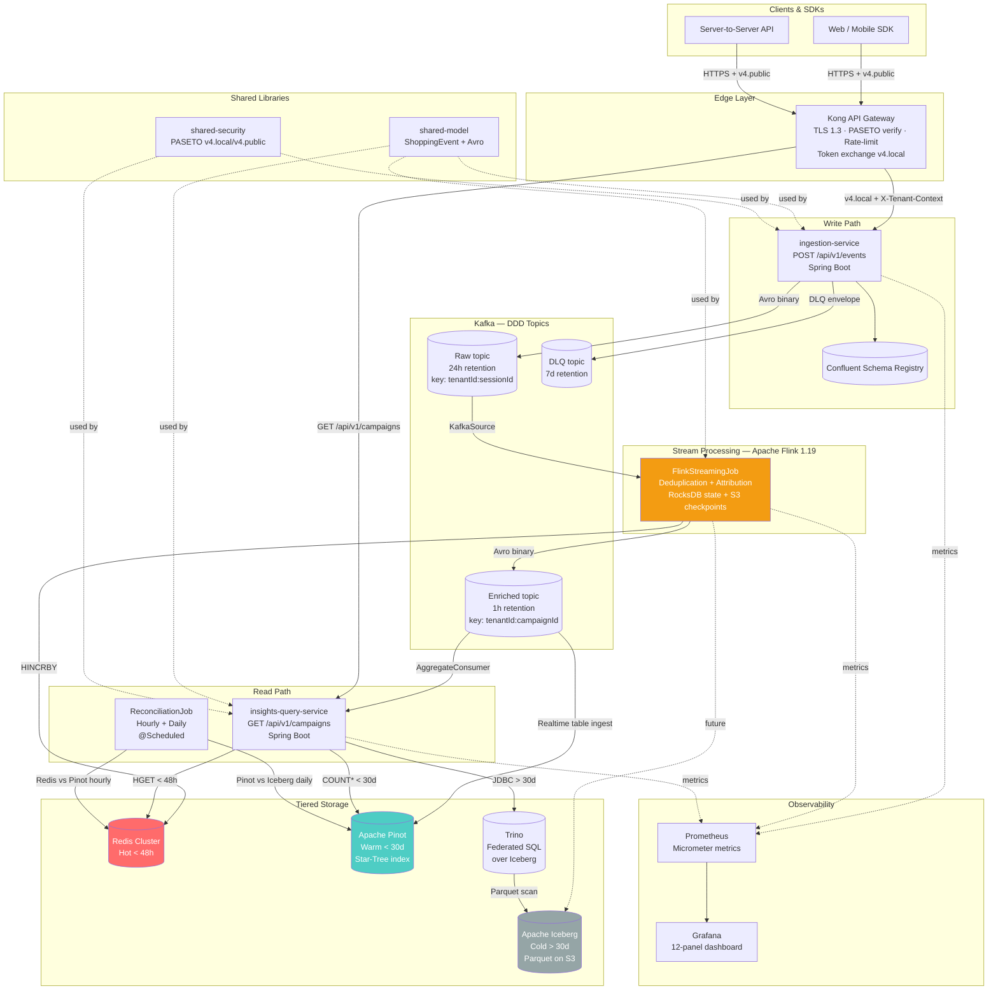
```mermaid
flowchart TD
    subgraph Clients["Clients & SDKs"]
        SDK[Web / Mobile SDK]
        S2S[Server-to-Server API]
    end

    subgraph Edge["Edge Layer"]
        GW[Kong API Gateway\nTLS 1.3 · PASETO verify · Rate-limit\nToken exchange v4.local]
    end

    subgraph WriteServices["Write Path"]
        IS[ingestion-service\nPOST /api/v1/events\nSpring Boot]
        SR[(Confluent Schema Registry)]
    end

    subgraph Kafka["Kafka — DDD Topics"]
        KR[(Raw topic\n24h retention\nkey: tenantId:sessionId)]
        KE[(Enriched topic\n1h retention\nkey: tenantId:campaignId)]
        KD[(DLQ topic\n7d retention)]
    end

    subgraph StreamEngine["Stream Processing — Apache Flink 1.19"]
        FJ[FlinkStreamingJob\nDeduplication + Attribution\nRocksDB state + S3 checkpoints]
    end

    subgraph Storage["Tiered Storage"]
        Redis[(Redis Cluster\nHot < 48h)]
        Pinot[(Apache Pinot\nWarm < 30d\nStar-Tree index)]
        Iceberg[(Apache Iceberg\nCold > 30d\nParquet on S3)]
        Trino[(Trino\nFederated SQL\nover Iceberg)]
    end

    subgraph ReadServices["Read Path"]
        QS[insights-query-service\nGET /api/v1/campaigns\nSpring Boot]
        Recon[ReconciliationJob\nHourly + Daily\n@Scheduled]
    end

    subgraph Security["Shared Libraries"]
        SM[shared-model\nShoppingEvent + Avro]
        SS[shared-security\nPASETO v4.local/v4.public]
    end

    subgraph Observability["Observability"]
        Prom[Prometheus\nMicrometer metrics]
        Graf[Grafana\n12-panel dashboard]
    end

    SDK -->|HTTPS + v4.public| GW
    S2S -->|HTTPS + v4.public| GW
    GW -->|v4.local + X-Tenant-Context| IS
    IS --> SR
    IS -->|Avro binary| KR
    IS -->|DLQ envelope| KD

    KR -->|KafkaSource| FJ
    FJ -->|HINCRBY| Redis
    FJ -->|Avro binary| KE
    FJ -.->|future| Iceberg

    KE -->|Realtime table ingest| Pinot
    KE -->|AggregateConsumer| QS

    GW -->|GET /api/v1/campaigns| QS
    QS -->|HGET < 48h| Redis
    QS -->|COUNT* < 30d| Pinot
    QS -->|JDBC > 30d| Trino
    Trino -->|Parquet scan| Iceberg

    Recon -->|Redis vs Pinot hourly| Redis
    Recon -->|Pinot vs Iceberg daily| Pinot

    IS -.->|metrics| Prom
    FJ -.->|metrics| Prom
    QS -.->|metrics| Prom
    Prom --> Graf

    SM -. used by .-> IS
    SM -. used by .-> FJ
    SM -. used by .-> QS
    SS -. used by .-> IS
    SS -. used by .-> QS

    style Redis fill:#ff6b6b,color:#fff
    style Pinot fill:#4ecdc4,color:#fff
    style Iceberg fill:#95a5a6,color:#fff
    style FJ fill:#f39c12,color:#fff
```

### 2.3. Data Flow — Write Path

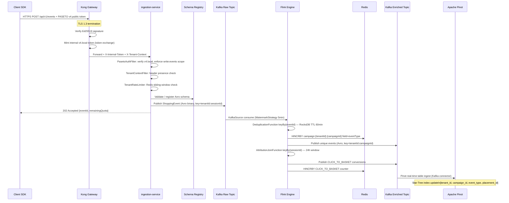
```mermaid
sequenceDiagram
    participant C as Client SDK
    participant K as Kong Gateway
    participant I as ingestion-service
    participant SR as Schema Registry
    participant KR as Kafka Raw Topic
    participant F as Flink Engine
    participant R as Redis
    participant KE as Kafka Enriched Topic
    participant P as Apache Pinot

    C->>K: HTTPS POST /api/v1/events + PASETO v4.public token
    Note over K: TLS 1.3 termination
    K->>K: Verify Ed25519 signature
    K->>K: Mint internal v4.local token (token exchange)
    K->>I: Forward + X-Internal-Token + X-Tenant-Context

    I->>I: PasetoAuthFilter: verify v4.local, enforce write:events scope
    I->>I: TenantContextFilter: header presence check
    I->>I: TenantRateLimiter: Redis sliding-window check
    I->>SR: Validate / register Avro schema
    I->>KR: Publish ShoppingEvent (Avro binary, key=tenantId:sessionId)
    I-->>C: 202 Accepted {eventId, remainingQuota}

    KR->>F: KafkaSource consume (WatermarkStrategy 5min)
    F->>F: DeduplicationFunction keyBy(eventId) — RocksDB TTL 60min
    F->>R: HINCRBY campaign:{tenantId}:{campaignId} field=eventType
    F->>KE: Publish unique events (Avro, key=tenantId:campaignId)
    F->>F: AttributionJoinFunction keyBy(sessionId) — 24h window
    F->>KE: Publish CLICK_TO_BASKET conversions
    F->>R: HINCRBY CLICK_TO_BASKET counter

    KE->>P: Pinot real-time table ingest (Kafka connector)
    Note over P: Star-Tree index update\n[tenant_id, campaign_id, event_type, placement_id]
```

### 2.4. Data Flow — Read Path

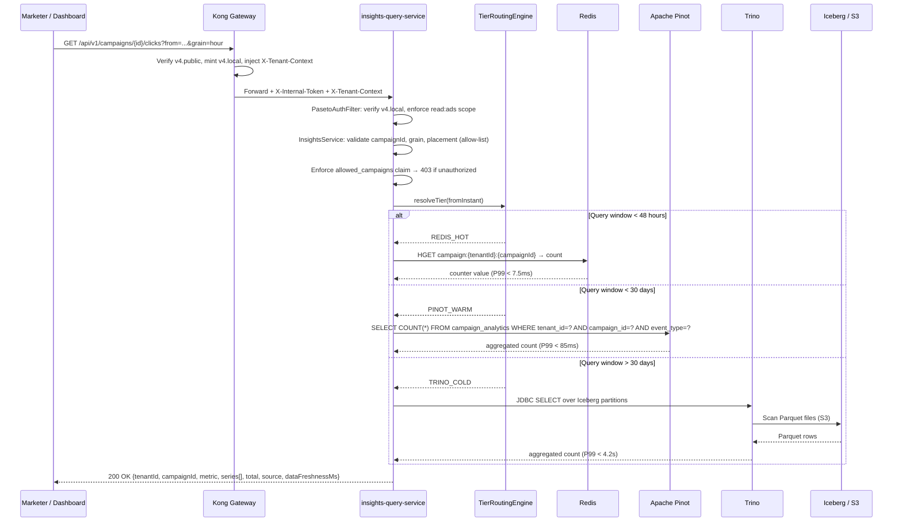
```mermaid
sequenceDiagram
    participant M as Marketer / Dashboard
    participant K as Kong Gateway
    participant Q as insights-query-service
    participant T as TierRoutingEngine
    participant R as Redis
    participant P as Apache Pinot
    participant TR as Trino
    participant IC as Iceberg / S3

    M->>K: GET /api/v1/campaigns/{id}/clicks?from=...&grain=hour
    K->>K: Verify v4.public, mint v4.local, inject X-Tenant-Context
    K->>Q: Forward + X-Internal-Token + X-Tenant-Context

    Q->>Q: PasetoAuthFilter: verify v4.local, enforce read:ads scope
    Q->>Q: InsightsService: validate campaignId, grain, placement (allow-list)
    Q->>Q: Enforce allowed_campaigns claim → 403 if unauthorized

    Q->>T: resolveTier(fromInstant)

    alt Query window < 48 hours
        T-->>Q: REDIS_HOT
        Q->>R: HGET campaign:{tenantId}:{campaignId} → count
        R-->>Q: counter value (P99 < 7.5ms)
    else Query window < 30 days
        T-->>Q: PINOT_WARM
        Q->>P: SELECT COUNT(*) FROM campaign_analytics WHERE tenant_id=? AND campaign_id=? AND event_type=?
        P-->>Q: aggregated count (P99 < 85ms)
    else Query window > 30 days
        T-->>Q: TRINO_COLD
        Q->>TR: JDBC SELECT over Iceberg partitions
        TR->>IC: Scan Parquet files (S3)
        IC-->>TR: Parquet rows
        TR-->>Q: aggregated count (P99 < 4.2s)
    end

    Q-->>M: 200 OK {tenantId, campaignId, metric, series[], total, source, dataFreshnessMs}
```

### 2.5. Data Flow — Reconciliation Path

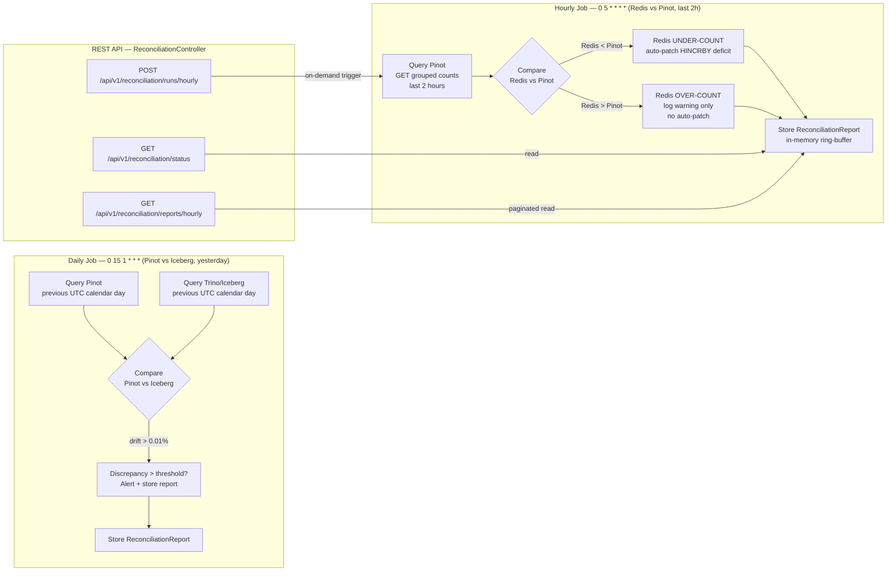
```mermaid
flowchart LR
    subgraph Hourly["Hourly Job — 0 5 * * * * (Redis vs Pinot, last 2h)"]
        H1[Query Pinot\nGET grouped counts\nlast 2 hours]
        H2{Compare\nRedis vs Pinot}
        H3[Redis UNDER-COUNT\nauto-patch HINCRBY deficit]
        H4[Redis OVER-COUNT\nlog warning only\nno auto-patch]
        H5[Store ReconciliationReport\nin-memory ring-buffer]
    end

    subgraph Daily["Daily Job — 0 15 1 * * * (Pinot vs Iceberg, yesterday)"]
        D1[Query Pinot\nprevious UTC calendar day]
        D2[Query Trino/Iceberg\nprevious UTC calendar day]
        D3{Compare\nPinot vs Iceberg}
        D4[Discrepancy > threshold?\nAlert + store report]
        D5[Store ReconciliationReport]
    end

    subgraph API["REST API — ReconciliationController"]
        A1[GET /api/v1/reconciliation/status]
        A2[GET /api/v1/reconciliation/reports/hourly]
        A3[POST /api/v1/reconciliation/runs/hourly]
    end

    H1 --> H2
    H2 -->|Redis < Pinot| H3
    H2 -->|Redis > Pinot| H4
    H3 --> H5
    H4 --> H5

    D1 --> D3
    D2 --> D3
    D3 -->|drift > 0.01%| D4
    D4 --> D5

    A3 -->|on-demand trigger| H1
    A1 -->|read| H5
    A2 -->|paginated read| H5
```

### 2.6. Multi-Region Topology

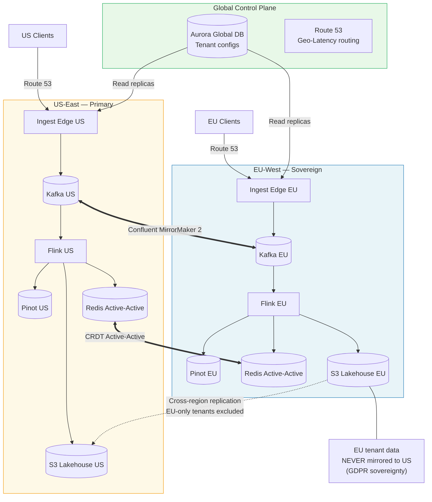
```mermaid
flowchart TB
    subgraph US["US-East — Primary"]
        IUS[Ingest Edge US]
        KUS[(Kafka US)]
        FUS[Flink US]
        PUS[(Pinot US)]
        RUS[(Redis Active-Active)]
        S3US[(S3 Lakehouse US)]
    end

    subgraph EU["EU-West — Sovereign"]
        IEU[Ingest Edge EU]
        KEU[(Kafka EU)]
        FEU[Flink EU]
        PEU[(Pinot EU)]
        REU[(Redis Active-Active)]
        S3EU[(S3 Lakehouse EU)]
    end

    subgraph Global["Global Control Plane"]
        CFG[(Aurora Global DB\nTenant configs)]
        DNS[Route 53\nGeo-Latency routing]
    end

    UserUS[US Clients] -->|Route 53| IUS
    UserEU[EU Clients] -->|Route 53| IEU

    IUS --> KUS --> FUS --> PUS
    IEU --> KEU --> FEU --> PEU
    FUS --> RUS
    FEU --> REU
    FUS --> S3US
    FEU --> S3EU

    KUS <==>|Confluent MirrorMaker 2| KEU
    RUS <==>|CRDT Active-Active| REU
    S3EU -.->|Cross-region replication\nEU-only tenants excluded| S3US

    CFG -->|Read replicas| IUS
    CFG -->|Read replicas| IEU

    note1["EU tenant data\nNEVER mirrored to US\n(GDPR sovereignty)"]
    S3EU --- note1

    style EU fill:#e8f4f8,stroke:#2980b9
    style US fill:#fef9e7,stroke:#f39c12
    style Global fill:#e8f8e8,stroke:#27ae60
```

### 2.7. Technology Stack Rationale

| Component | Technology | Why Chosen |
|:----------|:-----------|:-----------|
| **Edge gateway** | Kong (Nginx/Lua) | Sub-ms overhead; millions RPS; Lua plugins for custom rate-limiting; faster than JVM-based gateways |
| **Message broker** | Apache Kafka | Durable multi-day buffer; exactly-once with Flink; Schema Registry integration; 128 partitions/topic for parallelism |
| **Stream processor** | Apache Flink 1.19 | True event-time (not micro-batch); RocksDB keyed state for large session windows; exactly-once checkpoints; Spot-Instance safe via incremental recovery |
| **Hot tier** | Redis Cluster | Sub-ms `HINCRBY`; Active-Active CRDT for multi-region; also backs gateway rate limiter |
| **Warm tier** | Apache Pinot | Real-time Kafka ingestion; Star-Tree pre-aggregation → <15ms campaign `COUNT/SUM`; thousands of concurrent QPS |
| **Cold tier** | Iceberg + Trino | S3 Parquet ACID lakehouse (90% cost savings vs Pinot for >30d data); Trino decouples compute from storage |
| **Auth tokens** | PASETO v4 | Eliminates JWT `alg:none` + algorithm-confusion; `v4.public` = Ed25519 (fixed, no negotiation); `v4.local` = XChaCha20+BLAKE2b for internal mesh |
| **Serialization** | Confluent Avro | Compact binary; Schema Registry enforces forward/backward compatibility; integrates natively with Flink and Kafka connectors |

---

## 3. Database Schemas

### 3.1. Kafka Wire Schema (Avro)

All three Kafka topics carry `ShoppingEvent` in **Confluent wire format**: `[0x00][4-byte schemaId][Avro binary]`.

```avdl
@namespace("com.java.model")
protocol ShoppingEventProtocol {
  record ShoppingEvent {
    string eventId;                           // UUIDv4 — Flink dedup key
    string tenantId;                          // from verified X-Tenant-Context (never client body)
    union { null, string } userId     = null; // pseudonymized before logging
    union { null, string } sessionId  = null; // Kafka partition key + Flink attribution key
    union { null, string } campaignId = null; // attribution target
    string eventType;                         // IMPRESSION|CLICK|...|CLICK_TO_BASKET
    long   eventTimestampMs;                  // client epoch ms — Flink watermark source
    double cost              = 0.0;           // cost_per_click at time of event
    map<string> customTags   = {};            // durationMs + attributedClickId on CTB
  }
}
```

**Topic inventory:**

| Topic template | Key | Retention | Consumers |
|:---------------|:----|:----------|:----------|
| `{env}.shared.event.ads.clickstream.ad-interaction-received-by-tenant-session` | `tenantId:sessionId` | 24 h | Flink `KafkaSource` |
| `{env}.internal.event.ads.attribution.ad-interaction-enriched-by-campaign` | `tenantId:campaignId` | 1 h | Pinot real-time table + `AggregateConsumer` |
| `{env}.internal.event.ads.clickstream.ad-interaction-failed-by-tenant-id` | `tenantId` | 7 d | SRE replay tooling |

### 3.2. Apache Pinot Schema

Real-time OLAP table `campaign_analytics` — ingests from the Kafka enriched topic.

```json
{
  "schemaName": "campaign_analytics",
  "dimensionFieldSpecs": [
    { "name": "event_id",     "dataType": "STRING" },
    { "name": "tenant_id",    "dataType": "STRING" },
    { "name": "campaign_id",  "dataType": "STRING" },
    { "name": "ad_id",        "dataType": "STRING" },
    { "name": "placement_id", "dataType": "STRING" },
    { "name": "event_type",   "dataType": "STRING" },
    { "name": "geo_country",  "dataType": "STRING" },
    { "name": "device_type",  "dataType": "STRING" }
  ],
  "metricFieldSpecs": [
    { "name": "cost_per_click", "dataType": "DOUBLE" },
    { "name": "price",          "dataType": "DOUBLE" }
  ],
  "dateTimeFieldSpecs": [{
    "name": "event_timestamp_ms",
    "dataType": "LONG",
    "format": "1:MILLISECONDS:EPOCH",
    "granularity": "1:MINUTES"
  }]
}
```

**Star-Tree Index Configuration:**

```json
{
  "tableIndexConfig": {
    "starTreeIndexConfigs": [{
      "dimensionsSplitOrder": ["tenant_id", "campaign_id", "event_type", "placement_id"],
      "functionColumnPairs": ["COUNT__event_id", "SUM__cost_per_click"],
      "maxLeafRecords": 10000
    }]
  }
}
```

**Query compiled by the service:**

```sql
SELECT COUNT(*)
FROM   campaign_analytics
WHERE  tenant_id   = 'walmart_us'        -- RLS: always injected from verified token
  AND  campaign_id = 'cmp_spring_99a'    -- from path variable (allow-list validated)
  AND  event_type  = 'CLICK'
GROUP BY event_timestamp_ms / 3600000    -- grain bucket
```

### 3.3. Redis Key Schema

```
Key:   campaign:{tenantId}:{campaignId}          (Hash)
Field: {eventType}                               (e.g. CLICK, IMPRESSION, CLICK_TO_BASKET)
Value: Long counter                              (incremented atomically via HINCRBY)
TTL:   platform.flink.redis-ttl-seconds          (default 172800 = 48h; refreshed on every write)
```

**Examples:**

```
HSET  campaign:walmart_us:cmp_spring_99a  CLICK 41220
HSET  campaign:walmart_us:cmp_spring_99a  IMPRESSION 5304910
HSET  campaign:walmart_us:cmp_spring_99a  CLICK_TO_BASKET 1150
TTL   campaign:walmart_us:cmp_spring_99a  → 172800
```

**Rate-limiter key schema (sliding window):**

```
Key:   rate:{tenantId}:{windowBucket}            (String/counter)
Value: event count in current window
TTL:   platform.rate-limit.window-seconds * 2
```

### 3.4. Iceberg / Parquet Cold Schema

S3 path: `s3://{bucket}/warehouse/campaign_analytics/tenant_id={tenantId}/dt={date}/`

```
Column              Type          Notes
──────────────────────────────────────────────
event_id            STRING        deduplication key
tenant_id           STRING        Iceberg partition key (data sovereignty)
campaign_id         STRING
session_id          STRING
user_id             STRING        pseudonymized before write
event_type          STRING
event_timestamp_ms  BIGINT        epoch milliseconds
cost                DOUBLE
dt                  DATE          Iceberg partition (daily)
custom_tags         MAP<STRING,STRING>
```

**Trino query pattern (cold reads):**

```sql
SELECT event_type, COUNT(*) as cnt
FROM   iceberg.campaign_analytics
WHERE  tenant_id   = 'walmart_us'
  AND  campaign_id = 'cmp_spring_99a'
  AND  dt BETWEEN DATE '2026-01-01' AND DATE '2026-03-31'
GROUP BY event_type
```

---

## 4. Low-Level Design (LLD)

### 4.1. ingestion-service

#### Class Diagram

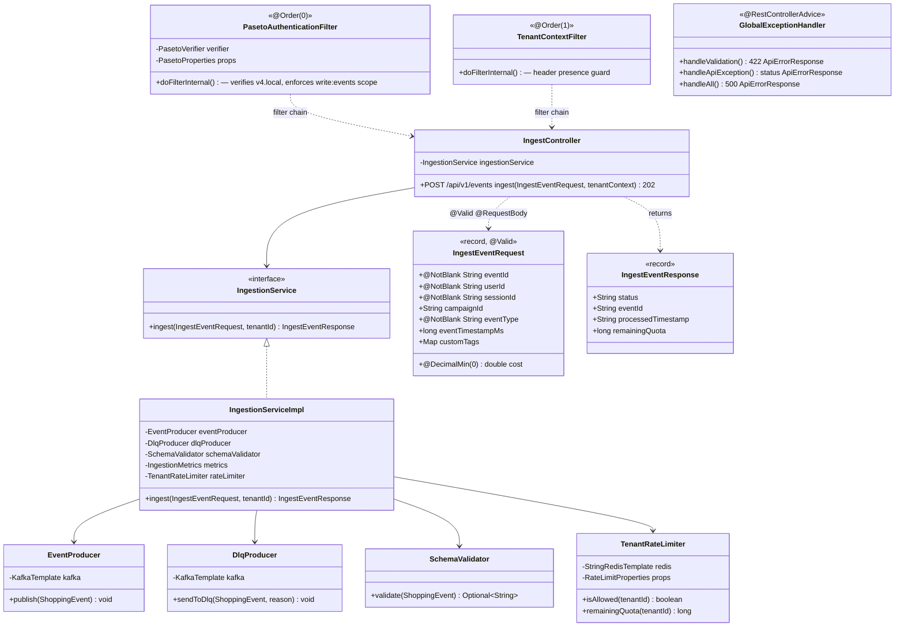
```mermaid
classDiagram
    direction TB

    class IngestController {
        -IngestionService ingestionService
        +POST /api/v1/events ingest(IngestEventRequest, tenantContext) 202
    }

    class IngestionService {
        <<interface>>
        +ingest(IngestEventRequest, tenantId) IngestEventResponse
    }

    class IngestionServiceImpl {
        -EventProducer eventProducer
        -DlqProducer dlqProducer
        -SchemaValidator schemaValidator
        -IngestionMetrics metrics
        -TenantRateLimiter rateLimiter
        +ingest(IngestEventRequest, tenantId) IngestEventResponse
    }

    class IngestEventRequest {
        <<record, @Valid>>
        +@NotBlank String eventId
        +@NotBlank String userId
        +@NotBlank String sessionId
        +String campaignId
        +@NotBlank String eventType
        +long eventTimestampMs
        +@DecimalMin(0) double cost
        +Map customTags
    }

    class IngestEventResponse {
        <<record>>
        +String status
        +String eventId
        +String processedTimestamp
        +long remainingQuota
    }

    class SchemaValidator {
        +validate(ShoppingEvent) Optional~String~
    }

    class TenantRateLimiter {
        -StringRedisTemplate redis
        -RateLimitProperties props
        +isAllowed(tenantId) boolean
        +remainingQuota(tenantId) long
    }

    class EventProducer {
        -KafkaTemplate kafka
        +publish(ShoppingEvent) void
    }

    class DlqProducer {
        -KafkaTemplate kafka
        +sendToDlq(ShoppingEvent, reason) void
    }

    class PasetoAuthenticationFilter {
        <<@Order(0)>>
        -PasetoVerifier verifier
        -PasetoProperties props
        +doFilterInternal() — verifies v4.local, enforces write:events scope
    }

    class TenantContextFilter {
        <<@Order(1)>>
        +doFilterInternal() — header presence guard
    }

    class GlobalExceptionHandler {
        <<@RestControllerAdvice>>
        +handleValidation() 422 ApiErrorResponse
        +handleApiException() status ApiErrorResponse
        +handleAll() 500 ApiErrorResponse
    }

    IngestController --> IngestionService
    IngestionService <|.. IngestionServiceImpl
    IngestionServiceImpl --> EventProducer
    IngestionServiceImpl --> DlqProducer
    IngestionServiceImpl --> SchemaValidator
    IngestionServiceImpl --> TenantRateLimiter
    IngestController ..> IngestEventRequest : @Valid @RequestBody
    IngestController ..> IngestEventResponse : returns
    PasetoAuthenticationFilter ..> IngestController : filter chain
    TenantContextFilter ..> IngestController : filter chain
```

#### Filter Chain & Request Lifecycle

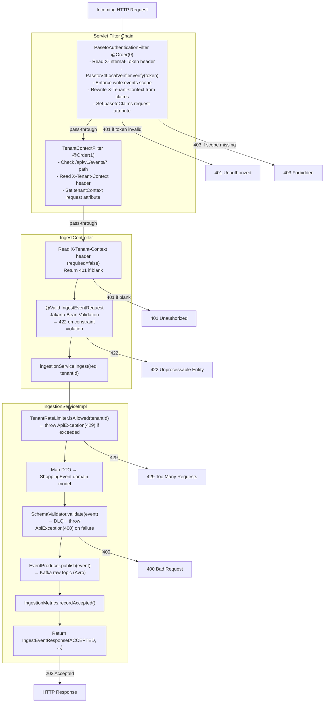
```mermaid
flowchart TD
    REQ[Incoming HTTP Request] --> F0

    subgraph Filters["Servlet Filter Chain"]
        F0["PasetoAuthenticationFilter @Order(0)\n- Read X-Internal-Token header\n- PasetoV4LocalVerifier.verify(token)\n- Enforce write:events scope\n- Rewrite X-Tenant-Context from claims\n- Set pasetoClaims request attribute"]
        F1["TenantContextFilter @Order(1)\n- Check /api/v1/events/* path\n- Read X-Tenant-Context header\n- Set tenantContext request attribute"]
    end

    subgraph Controller["IngestController"]
        C1["Read X-Tenant-Context header\n(required=false)\nReturn 401 if blank"]
        C2["@Valid IngestEventRequest\nJakarta Bean Validation\n→ 422 on constraint violation"]
        C3["ingestionService.ingest(req, tenantId)"]
    end

    subgraph Service["IngestionServiceImpl"]
        S1["TenantRateLimiter.isAllowed(tenantId)\n→ throw ApiException(429) if exceeded"]
        S2["Map DTO → ShoppingEvent domain model"]
        S3["SchemaValidator.validate(event)\n→ DLQ + throw ApiException(400) on failure"]
        S4["EventProducer.publish(event)\n→ Kafka raw topic (Avro)"]
        S5["IngestionMetrics.recordAccepted()"]
        S6["Return IngestEventResponse(ACCEPTED, ...)"]
    end

    F0 -->|pass-through| F1
    F1 -->|pass-through| C1
    C1 --> C2
    C2 --> C3
    C3 --> S1
    S1 --> S2
    S2 --> S3
    S3 --> S4
    S4 --> S5
    S5 --> S6
    S6 -->|202 Accepted| RESP[HTTP Response]

    F0 -->|401 if token invalid| ERR1[401 Unauthorized]
    F0 -->|403 if scope missing| ERR2[403 Forbidden]
    C1 -->|401 if blank| ERR3[401 Unauthorized]
    C2 -->|422| ERR4[422 Unprocessable Entity]
    S1 -->|429| ERR5[429 Too Many Requests]
    S3 -->|400| ERR6[400 Bad Request]
```

---

### 4.2. stream-processing-engine

#### Flink Job DAG

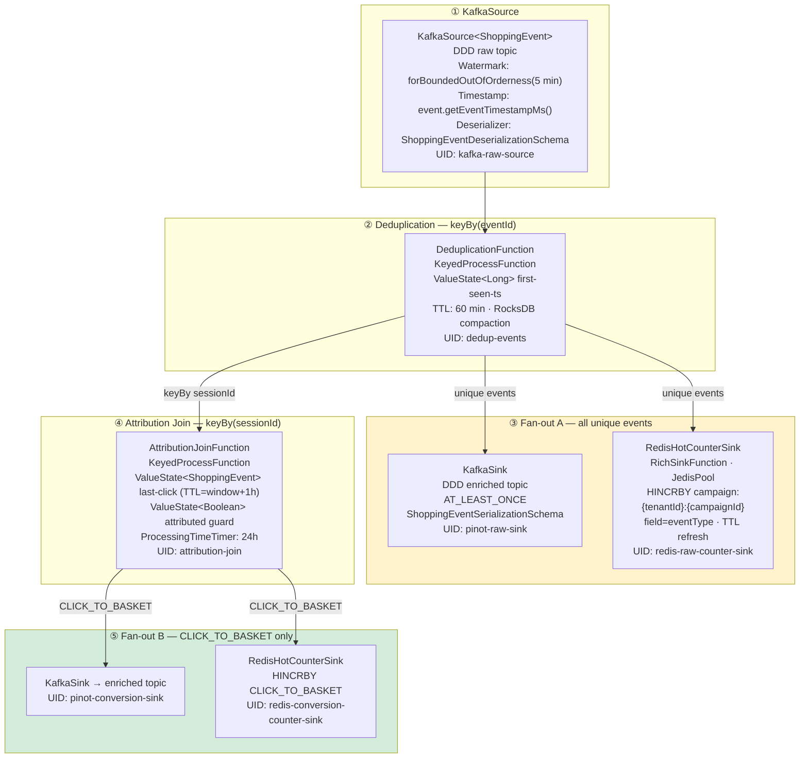
```mermaid
flowchart TD
    subgraph Source["① KafkaSource"]
        KS["KafkaSource&lt;ShoppingEvent&gt;\nDDD raw topic\nWatermark: forBoundedOutOfOrderness(5 min)\nTimestamp: event.getEventTimestampMs()\nDeserializer: ShoppingEventDeserializationSchema\nUID: kafka-raw-source"]
    end

    subgraph Dedup["② Deduplication — keyBy(eventId)"]
        DF["DeduplicationFunction\nKeyedProcessFunction\nValueState&lt;Long&gt; first-seen-ts\nTTL: 60 min · RocksDB compaction\nUID: dedup-events"]
    end

    subgraph FanA["③ Fan-out A — all unique events"]
        KS1["KafkaSink\nDDD enriched topic\nAT_LEAST_ONCE\nShoppingEventSerializationSchema\nUID: pinot-raw-sink"]
        RS1["RedisHotCounterSink\nRichSinkFunction · JedisPool\nHINCRBY campaign:{tenantId}:{campaignId}\nfield=eventType · TTL refresh\nUID: redis-raw-counter-sink"]
    end

    subgraph Attr["④ Attribution Join — keyBy(sessionId)"]
        AJ["AttributionJoinFunction\nKeyedProcessFunction\nValueState&lt;ShoppingEvent&gt; last-click (TTL=window+1h)\nValueState&lt;Boolean&gt; attributed guard\nProcessingTimeTimer: 24h\nUID: attribution-join"]
    end

    subgraph FanB["⑤ Fan-out B — CLICK_TO_BASKET only"]
        KS2["KafkaSink → enriched topic\nUID: pinot-conversion-sink"]
        RS2["RedisHotCounterSink\nHINCRBY CLICK_TO_BASKET\nUID: redis-conversion-counter-sink"]
    end

    KS --> DF
    DF -->|unique events| KS1
    DF -->|unique events| RS1
    DF -->|keyBy sessionId| AJ
    AJ -->|CLICK_TO_BASKET| KS2
    AJ -->|CLICK_TO_BASKET| RS2

    style FanA fill:#fff3cd
    style FanB fill:#d4edda
```

#### State Machines

**DeduplicationFunction state machine:**

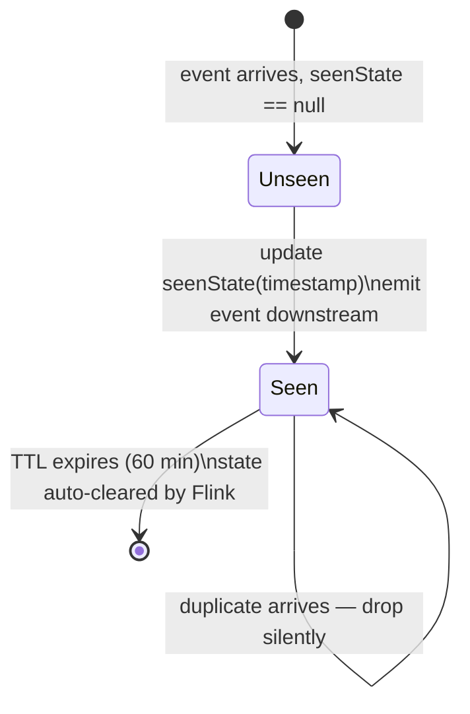
```mermaid
stateDiagram-v2
    [*] --> Unseen : event arrives, seenState == null
    Unseen --> Seen : update seenState(timestamp)\nemit event downstream
    Seen --> Seen : duplicate arrives — drop silently
    Seen --> [*] : TTL expires (60 min)\nstate auto-cleared by Flink
```

**AttributionJoinFunction state machine:**

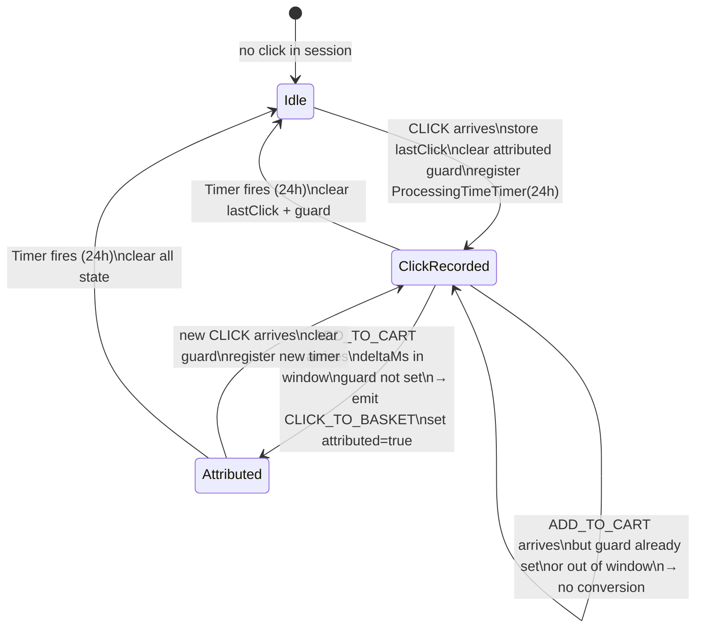
```mermaid
stateDiagram-v2
    [*] --> Idle : no click in session

    Idle --> ClickRecorded : CLICK arrives\nstore lastClick\nclear attributed guard\nregister ProcessingTimeTimer(24h)

    ClickRecorded --> Attributed : ADD_TO_CART arrives\ndeltaMs in window\nguard not set\n→ emit CLICK_TO_BASKET\nset attributed=true

    ClickRecorded --> ClickRecorded : ADD_TO_CART arrives\nbut guard already set\nor out of window\n→ no conversion

    ClickRecorded --> Idle : Timer fires (24h)\nclear lastClick + guard

    Attributed --> ClickRecorded : new CLICK arrives\nclear guard\nregister new timer

    Attributed --> Idle : Timer fires (24h)\nclear all state
```

---

### 4.3. insights-query-service

#### Class Diagram

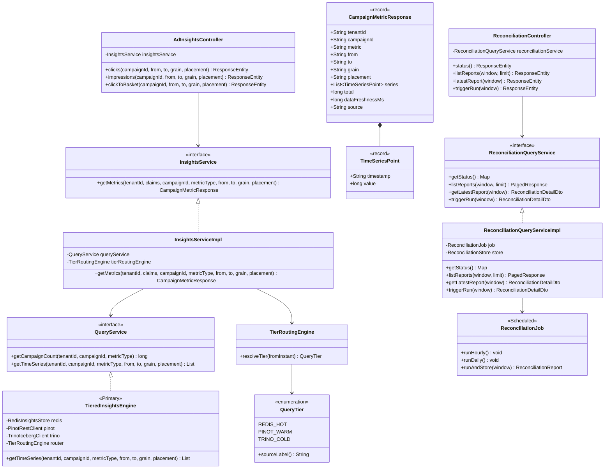
```mermaid
classDiagram
    direction TB

    class AdInsightsController {
        -InsightsService insightsService
        +clicks(campaignId, from, to, grain, placement) ResponseEntity
        +impressions(campaignId, from, to, grain, placement) ResponseEntity
        +clickToBasket(campaignId, from, to, grain, placement) ResponseEntity
    }

    class InsightsService {
        <<interface>>
        +getMetrics(tenantId, claims, campaignId, metricType, from, to, grain, placement) CampaignMetricResponse
    }

    class InsightsServiceImpl {
        -QueryService queryService
        -TierRoutingEngine tierRoutingEngine
        +getMetrics(tenantId, claims, campaignId, metricType, from, to, grain, placement) CampaignMetricResponse
    }

    class CampaignMetricResponse {
        <<record>>
        +String tenantId
        +String campaignId
        +String metric
        +String from
        +String to
        +String grain
        +String placement
        +List~TimeSeriesPoint~ series
        +long total
        +long dataFreshnessMs
        +String source
    }

    class TimeSeriesPoint {
        <<record>>
        +String timestamp
        +long value
    }

    class TierRoutingEngine {
        +resolveTier(fromInstant) QueryTier
    }

    class QueryTier {
        <<enumeration>>
        REDIS_HOT
        PINOT_WARM
        TRINO_COLD
        +sourceLabel() String
    }

    class QueryService {
        <<interface>>
        +getCampaignCount(tenantId, campaignId, metricType) long
        +getTimeSeries(tenantId, campaignId, metricType, from, to, grain, placement) List
    }

    class TieredInsightsEngine {
        <<Primary>>
        -RedisInsightsStore redis
        -PinotRestClient pinot
        -TrinoIcebergClient trino
        -TierRoutingEngine router
        +getTimeSeries(tenantId, campaignId, metricType, from, to, grain, placement) List
    }

    class ReconciliationController {
        -ReconciliationQueryService reconciliationService
        +status() ResponseEntity
        +listReports(window, limit) ResponseEntity
        +latestReport(window) ResponseEntity
        +triggerRun(window) ResponseEntity
    }

    class ReconciliationQueryService {
        <<interface>>
        +getStatus() Map
        +listReports(window, limit) PagedResponse
        +getLatestReport(window) ReconciliationDetailDto
        +triggerRun(window) ReconciliationDetailDto
    }

    class ReconciliationQueryServiceImpl {
        -ReconciliationJob job
        -ReconciliationStore store
        +getStatus() Map
        +listReports(window, limit) PagedResponse
        +getLatestReport(window) ReconciliationDetailDto
        +triggerRun(window) ReconciliationDetailDto
    }

    class ReconciliationJob {
        <<Scheduled>>
        +runHourly() void
        +runDaily() void
        +runAndStore(window) ReconciliationReport
    }

    AdInsightsController --> InsightsService
    InsightsService <|.. InsightsServiceImpl
    InsightsServiceImpl --> QueryService
    InsightsServiceImpl --> TierRoutingEngine
    TierRoutingEngine --> QueryTier
    QueryService <|.. TieredInsightsEngine
    CampaignMetricResponse *-- TimeSeriesPoint
    ReconciliationController --> ReconciliationQueryService
    ReconciliationQueryService <|.. ReconciliationQueryServiceImpl
    ReconciliationQueryServiceImpl --> ReconciliationJob
```

---

### 4.4. shared-model

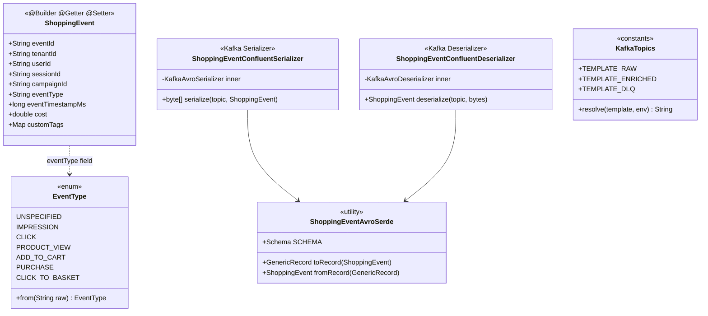
```mermaid
classDiagram
    class ShoppingEvent {
        <<@Builder @Getter @Setter>>
        +String eventId
        +String tenantId
        +String userId
        +String sessionId
        +String campaignId
        +String eventType
        +long eventTimestampMs
        +double cost
        +Map customTags
    }

    class EventType {
        <<enum>>
        UNSPECIFIED
        IMPRESSION
        CLICK
        PRODUCT_VIEW
        ADD_TO_CART
        PURCHASE
        CLICK_TO_BASKET
        +from(String raw) EventType
    }

    class ShoppingEventAvroSerde {
        <<utility>>
        +Schema SCHEMA
        +GenericRecord toRecord(ShoppingEvent)
        +ShoppingEvent fromRecord(GenericRecord)
    }

    class ShoppingEventConfluentSerializer {
        <<Kafka Serializer>>
        -KafkaAvroSerializer inner
        +byte[] serialize(topic, ShoppingEvent)
    }

    class ShoppingEventConfluentDeserializer {
        <<Kafka Deserializer>>
        -KafkaAvroDeserializer inner
        +ShoppingEvent deserialize(topic, bytes)
    }

    class KafkaTopics {
        <<constants>>
        +TEMPLATE_RAW
        +TEMPLATE_ENRICHED
        +TEMPLATE_DLQ
        +resolve(template, env) String
    }

    ShoppingEvent ..> EventType : eventType field
    ShoppingEventConfluentSerializer --> ShoppingEventAvroSerde
    ShoppingEventConfluentDeserializer --> ShoppingEventAvroSerde
```

---

### 4.5. shared-security

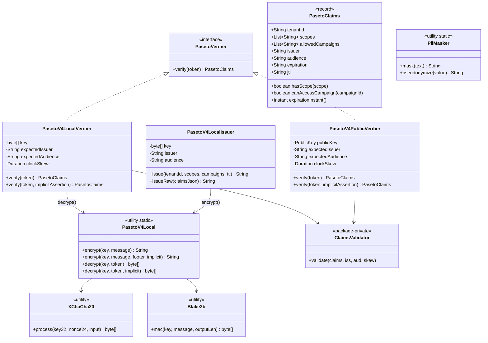
```mermaid
classDiagram
    class PasetoVerifier {
        <<interface>>
        +verify(token) PasetoClaims
    }

    class PasetoV4PublicVerifier {
        -PublicKey publicKey
        -String expectedIssuer
        -String expectedAudience
        -Duration clockSkew
        +verify(token) PasetoClaims
        +verify(token, implicitAssertion) PasetoClaims
    }

    class PasetoV4LocalVerifier {
        -byte[] key
        -String expectedIssuer
        -String expectedAudience
        -Duration clockSkew
        +verify(token) PasetoClaims
        +verify(token, implicitAssertion) PasetoClaims
    }

    class PasetoV4Local {
        <<utility static>>
        +encrypt(key, message) String
        +encrypt(key, message, footer, implicit) String
        +decrypt(key, token) byte[]
        +decrypt(key, token, implicit) byte[]
    }

    class PasetoV4LocalIssuer {
        -byte[] key
        -String issuer
        -String audience
        +issue(tenantId, scopes, campaigns, ttl) String
        +issueRaw(claimsJson) String
    }

    class PasetoClaims {
        <<record>>
        +String tenantId
        +List~String~ scopes
        +List~String~ allowedCampaigns
        +String issuer
        +String audience
        +String expiration
        +String jti
        +boolean hasScope(scope)
        +boolean canAccessCampaign(campaignId)
        +Instant expirationInstant()
    }

    class ClaimsValidator {
        <<package-private>>
        +validate(claims, iss, aud, skew)
    }

    class XChaCha20 {
        <<utility>>
        +process(key32, nonce24, input) byte[]
    }

    class Blake2b {
        <<utility>>
        +mac(key, message, outputLen) byte[]
    }

    class PiiMasker {
        <<utility static>>
        +mask(text) String
        +pseudonymize(value) String
    }

    PasetoVerifier <|.. PasetoV4PublicVerifier
    PasetoVerifier <|.. PasetoV4LocalVerifier
    PasetoV4LocalVerifier --> PasetoV4Local : decrypt()
    PasetoV4LocalVerifier --> ClaimsValidator
    PasetoV4PublicVerifier --> ClaimsValidator
    PasetoV4Local --> XChaCha20
    PasetoV4Local --> Blake2b
    PasetoV4LocalIssuer --> PasetoV4Local : encrypt()
```

---

## 5. API Contracts

### 5.1. Ingestion API

**Base URL:** `http://ingestion-service:8080`

#### `POST /api/v1/events`

| | |
|:--|:--|
| **Auth** | `X-Internal-Token: v4.local` (gateway-minted) · `X-Tenant-Context: {tenantId}` |
| **Scope required** | `write:events` |
| **Content-Type** | `application/json` |

**Request body (`IngestEventRequest`):**

```json
{
  "eventId":          "evt-uuid-v4",
  "userId":           "usr_abc",
  "sessionId":        "sess_xyz",
  "campaignId":       "cmp_spring_99a",
  "eventType":        "CLICK",
  "eventTimestampMs": 1750000000000,
  "cost":             0.05,
  "customTags": { "device": "mobile" }
}
```

| Field | Constraint | Notes |
|:------|:-----------|:------|
| `eventId` | `@NotBlank`, max 128 | Deduplication key in Flink |
| `userId` | `@NotBlank`, max 128 | Pseudonymized before logging |
| `sessionId` | `@NotBlank`, max 128 | Attribution join key |
| `campaignId` | max 128, optional | Attribution target |
| `eventType` | `@NotBlank` | One of `EventType` enum values |
| `cost` | `@DecimalMin(0.0)` | Cost in USD |

**Responses:**

| Status | Condition | Body |
|:-------|:----------|:-----|
| `202 Accepted` | Event accepted + dispatched | `{status, eventId, processedTimestamp, remainingQuota}` |
| `401 Unauthorized` | Missing `X-Tenant-Context` | `{timestamp, status, error, message, path}` |
| `403 Forbidden` | Missing `write:events` scope | `{timestamp, status, error, message, path}` |
| `422 Unprocessable Entity` | Jakarta validation failure | `{…, fieldErrors:[{field,message}]}` |
| `429 Too Many Requests` | Rate limit exceeded | `{error, tenantId}` |
| `400 Bad Request` | Unrecognized `eventType` (sent to DLQ) | `{error}` |

---

### 5.2. Campaign Insights API

**Base URL:** `http://insights-query-service:8083`  
**Swagger UI:** `http://insights-query-service:8083/swagger-ui.html`

#### `GET /api/v1/campaigns/{campaignId}/clicks`
#### `GET /api/v1/campaigns/{campaignId}/impressions`
#### `GET /api/v1/campaigns/{campaignId}/click-to-basket`

| | |
|:--|:--|
| **Auth** | `X-Internal-Token: v4.local` · `X-Tenant-Context: {tenantId}` |
| **Scope required** | `read:ads` |

**Query parameters:**

| Param | Default | Validation | Description |
|:------|:--------|:-----------|:------------|
| `from` | hot window | ISO-8601 | Window start |
| `to` | now | ISO-8601 | Window end |
| `grain` | `hour` | `minute\|hour\|day` | Bucket size; 400 otherwise |
| `placement` | all | `[A-Za-z0-9_.:-]{1,128}` | Filter by placement |

**Response (`CampaignMetricResponse`):**

```json
{
  "tenantId":        "walmart_us",
  "campaignId":      "cmp_spring_99a",
  "metric":          "click",
  "from":            "2026-06-25T00:00:00Z",
  "to":              "2026-06-26T00:00:00Z",
  "grain":           "hour",
  "series": [
    { "timestamp": "2026-06-25T00:00:00Z", "value": 41220 },
    { "timestamp": "2026-06-25T01:00:00Z", "value": 47120 }
  ],
  "total":           88340,
  "dataFreshnessMs": 1050,
  "source":          "pinot-warm"
}
```

---

### 5.3. Reconciliation API

#### `GET /api/v1/reconciliation/status`

Returns the latest run summary per window type.

```json
{
  "hourly": {
    "runId": "uuid", "status": "OK", "campaigns": 1247,
    "discrepancies": 0, "autoPatched": 0, "elapsedMs": 340
  },
  "daily": { "status": "NO_RUN_YET" }
}
```

#### `GET /api/v1/reconciliation/reports/{window}?limit=10`

Returns `PagedResponse<ReconciliationSummaryDto>` — newest first.

#### `GET /api/v1/reconciliation/reports/{window}/latest`

Returns `ReconciliationDetailDto` with per-campaign `results[]`.

#### `POST /api/v1/reconciliation/runs/{window}`

Triggers an on-demand run. Returns `ReconciliationDetailDto`. ⚠️ Protect with admin role in production.

---

## 6. Algorithms & Core Logic

### 6.1. Stream Deduplication

**Problem:** Network retries, SDK double-fires, and producer failovers cause the same `eventId` to arrive multiple times. Duplicate events inflate campaign metrics.

**Algorithm (`DeduplicationFunction`):**

```
State: ValueState<Long> seenState  (keyed by eventId)
TTL:   60 minutes (RocksDB StateTtlConfig, UpdateType=OnCreateAndWrite)

On event arrival:
  IF seenState.value() == null:
    seenState.update(event.eventTimestampMs)
    emit(event)                  // first occurrence → forward
  ELSE:
    drop silently                // duplicate → discard
```

**TTL choice:** 60 minutes covers all realistic retry windows (mobile SDKs retry up to 30 min). A longer TTL would grow RocksDB unnecessarily; a shorter TTL would pass duplicates from edge retries.

**Memory bound:** At 150K unique events/sec × 3600 sec × ~50 bytes/entry ≈ 27 GB per dedup window — well within RocksDB NVMe capacity on production TaskManagers.

### 6.2. Sessionized Attribution Join

**Problem:** A `CLICK_TO_BASKET` conversion requires correlating a `CLICK` event (containing `campaignId`) with a later `ADD_TO_CART` event (containing only `sessionId`) from the same user session. These events arrive on different timestamps.

**Algorithm (`AttributionJoinFunction`):**

```
State per session (keyed by sessionId):
  ValueState<ShoppingEvent> lastClick    (TTL = attributionWindow + 1h)
  ValueState<Boolean>       attributed   (TTL = attributionWindow + 1h)

On CLICK event:
  lastClick.update(event)
  attributed.clear()                     // reset guard for this click
  register ProcessingTimeTimer(now + 24h)

On ADD_TO_CART event:
  click = lastClick.value()
  IF click == null: return               // no prior click in this session
  deltaMs = event.timestamp - click.timestamp
  IF 0 ≤ deltaMs ≤ 24h AND attributed.value() == null:
    attributed.update(true)              // guard: one attribution per click
    emit CLICK_TO_BASKET {
      campaignId:       click.campaignId,   // attributed to the click's campaign
      eventId:          cart.eventId + "_att",
      customTags: { durationMs, attributedClickId }
    }

On Timer fire (24h):
  lastClick.clear()
  attributed.clear()                     // attribution window expired
```

**Why processing-time timer vs. event-time:** The attribution window is a business policy (24h from the user's perspective), not a strict temporal ordering requirement. Processing-time timers are simpler, more reliable under backpressure, and require no watermark advancement.

### 6.3. Tiered Query Routing

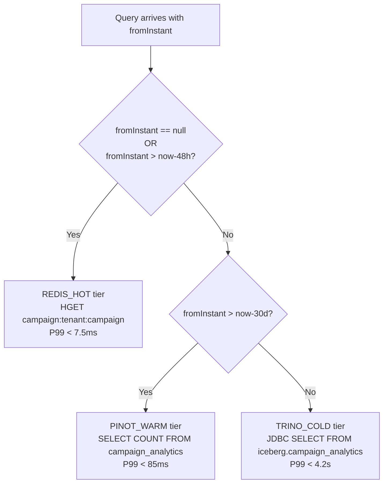
```mermaid
flowchart TD
    Q[Query arrives with fromInstant] --> R1{fromInstant == null\nOR\nfromInstant > now-48h?}
    R1 -->|Yes| REDIS[REDIS_HOT tier\nHGET campaign:tenant:campaign\nP99 < 7.5ms]
    R1 -->|No| R2{fromInstant > now-30d?}
    R2 -->|Yes| PINOT[PINOT_WARM tier\nSELECT COUNT FROM campaign_analytics\nP99 < 85ms]
    R2 -->|No| TRINO[TRINO_COLD tier\nJDBC SELECT FROM iceberg.campaign_analytics\nP99 < 4.2s]
```

**Implementation (`TierRoutingEngine`):**

```java
public QueryTier resolveTier(Instant fromInstant) {
    if (fromInstant == null || fromInstant.isAfter(Instant.now().minus(48, HOURS)))
        return QueryTier.REDIS_HOT;
    if (fromInstant.isAfter(Instant.now().minus(30, DAYS)))
        return QueryTier.PINOT_WARM;
    return QueryTier.TRINO_COLD;
}
```

### 6.4. PASETO Token Exchange (Option C)

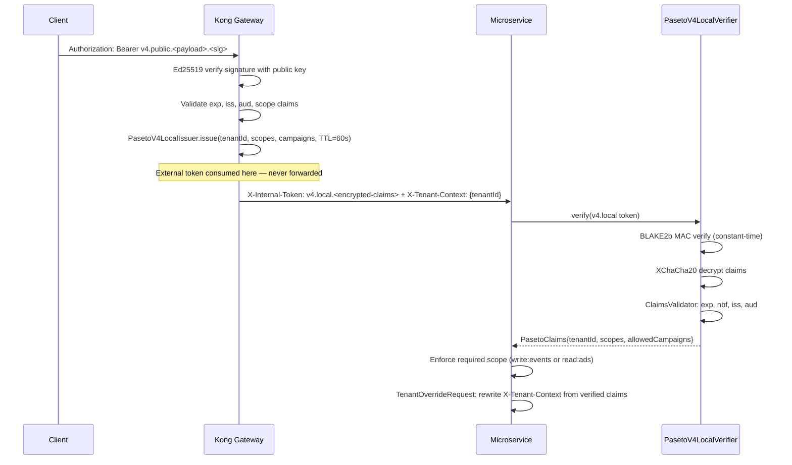
```mermaid
sequenceDiagram
    participant C as Client
    participant K as Kong Gateway
    participant S as Microservice
    participant V as PasetoV4LocalVerifier

    C->>K: Authorization: Bearer v4.public.<payload>.<sig>
    K->>K: Ed25519 verify signature with public key
    K->>K: Validate exp, iss, aud, scope claims
    K->>K: PasetoV4LocalIssuer.issue(tenantId, scopes, campaigns, TTL=60s)
    Note over K: External token consumed here — never forwarded
    K->>S: X-Internal-Token: v4.local.<encrypted-claims> + X-Tenant-Context: {tenantId}

    S->>V: verify(v4.local token)
    V->>V: BLAKE2b MAC verify (constant-time)
    V->>V: XChaCha20 decrypt claims
    V->>V: ClaimsValidator: exp, nbf, iss, aud
    V-->>S: PasetoClaims{tenantId, scopes, allowedCampaigns}
    S->>S: Enforce required scope (write:events or read:ads)
    S->>S: TenantOverrideRequest: rewrite X-Tenant-Context from verified claims
```

**v4.local encryption internals:**

```
nonce(32B) ← SecureRandom

Ek(32B) ‖ n2(24B) = BLAKE2b(key, "paseto-encryption-key" ‖ nonce, outputLen=56)
ak(32B)            = BLAKE2b(key, "paseto-auth-key-for-aead" ‖ nonce, outputLen=32)

ciphertext = XChaCha20(Ek, n2, plaintext_json)
preAuth    = PAE(header, nonce, ciphertext, footer, implicit)
tag(32B)   = BLAKE2b(ak, preAuth, outputLen=32)

token = "v4.local." + base64url(nonce ‖ ciphertext ‖ tag)
```

### 6.5. Reconciliation Algorithm

**Hourly (Redis vs Pinot):**

```
window = [now - 2h, now]
pinotCounts = PinotRestClient.queryGroupedCounts(window, maxCampaigns=10000)

for each (tenantId, campaignId, eventType, pinotCount) in pinotCounts:
    redisCount = HGET campaign:{tenantId}:{campaignId} field={eventType} ?: 0

    if redisCount < pinotCount AND auto-correct-redis=true:
        deficit = pinotCount - redisCount
        HINCRBY campaign:{tenantId}:{campaignId} {eventType} deficit  // auto-patch
        patched = true
    elif redisCount > pinotCount:
        LOG WARN "Redis over-count (possible in-flight events)"
        patched = false  // never reduce Redis — Pinot may have ingestion lag

    record ReconciliationResult(key, referenceStore=pinot, pinotCount,
                                observedStore=redis, redisCount, patched)

store report in ReconciliationStore (ring-buffer, max 48 entries)
emit Micrometer metrics
```

**Daily (Pinot vs Iceberg):**

```
window = [yesterday 00:00 UTC, today 00:00 UTC]
pinotCounts  = PinotRestClient.queryGroupedCounts(window)
icebergCount = TrinoIcebergClient.queryCount(tenantId, campaignId, eventType)

discrepancyPct = |pinotCount - icebergCount| / icebergCount * 100
if discrepancyPct > threshold (default 0.01%):
    LOG WARN "Discrepancy detected"
    emit ads.reconciliation.discrepancies counter
```

---

## 7. Security Design

### 7.1. Authentication Flow

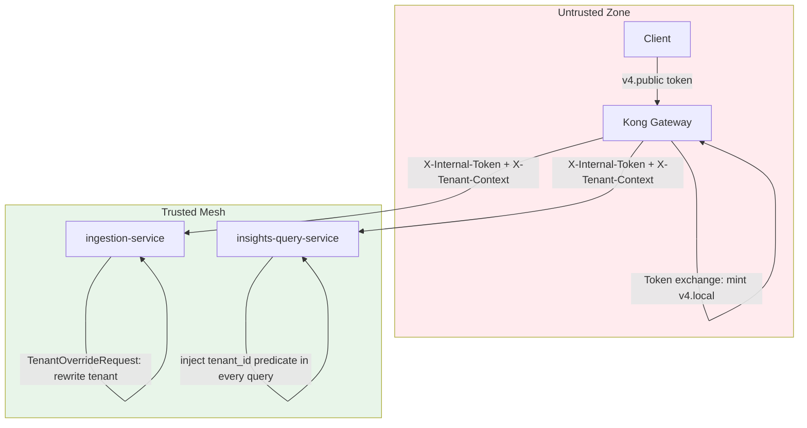
```mermaid
flowchart TD
    subgraph External["Untrusted Zone"]
        C[Client] -->|v4.public token| K[Kong Gateway]
    end

    subgraph Internal["Trusted Mesh"]
        IS[ingestion-service]
        QS[insights-query-service]
    end

    K -->|Verify Ed25519 signature| K
    K -->|Token exchange: mint v4.local| K
    K -->|X-Internal-Token + X-Tenant-Context| IS
    K -->|X-Internal-Token + X-Tenant-Context| QS

    IS -->|PasetoV4LocalVerifier.verify| IS
    IS -->|enforce write:events scope| IS
    IS -->|TenantOverrideRequest: rewrite tenant| IS

    QS -->|PasetoV4LocalVerifier.verify| QS
    QS -->|enforce read:ads scope| QS
    QS -->|enforce allowed_campaigns| QS
    QS -->|inject tenant_id predicate in every query| QS

    style External fill:#ffebee
    style Internal fill:#e8f5e9
```

### 7.2. Multi-Tenant Isolation Matrix

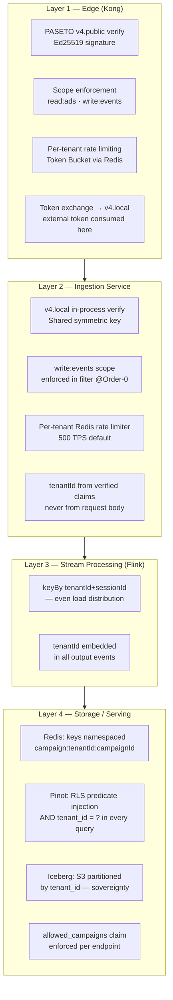
```mermaid
flowchart TD
    subgraph L1["Layer 1 — Edge (Kong)"]
        G1[PASETO v4.public verify\nEd25519 signature]
        G2[Scope enforcement\nread:ads · write:events]
        G3[Per-tenant rate limiting\nToken Bucket via Redis]
        G4[Token exchange → v4.local\nexternal token consumed here]
    end

    subgraph L2["Layer 2 — Ingestion Service"]
        I1[v4.local in-process verify\nShared symmetric key]
        I2["write:events scope\nenforced in filter @Order-0"]
        I3[Per-tenant Redis rate limiter\n500 TPS default]
        I4[tenantId from verified claims\nnever from request body]
    end

    subgraph L3["Layer 3 — Stream Processing (Flink)"]
        F1[keyBy tenantId+sessionId\n— even load distribution]
        F2[tenantId embedded\nin all output events]
    end

    subgraph L4["Layer 4 — Storage / Serving"]
        S1[Redis: keys namespaced\ncampaign:tenantId:campaignId]
        S2[Pinot: RLS predicate injection\nAND tenant_id = ? in every query]
        S3[Iceberg: S3 partitioned\nby tenant_id — sovereignty]
        S4[allowed_campaigns claim\nenforced per endpoint]
    end

    L1 --> L2 --> L3 --> L4
```

---

## 8. Scalability & Fault Tolerance

### 8.1. Auto-Scaling Strategy

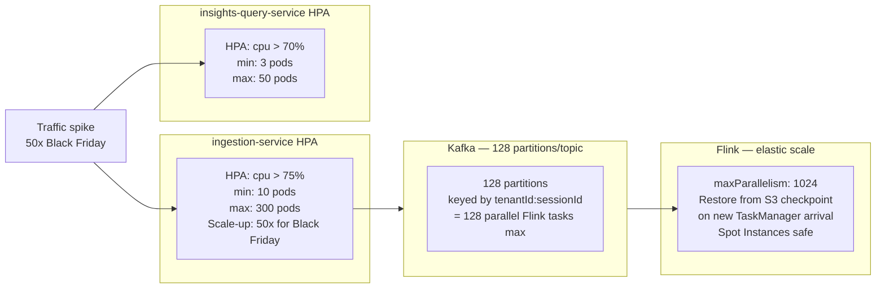
```mermaid
flowchart LR
    subgraph Ingest["ingestion-service HPA"]
        HPA["HPA: cpu > 75%\nmin: 10 pods\nmax: 300 pods\nScale-up: 50x for Black Friday"]
    end

    subgraph Kafka["Kafka — 128 partitions/topic"]
        P["128 partitions\nkeyed by tenantId:sessionId\n= 128 parallel Flink tasks max"]
    end

    subgraph Flink["Flink — elastic scale"]
        FK["maxParallelism: 1024\nRestore from S3 checkpoint\non new TaskManager arrival\nSpot Instances safe"]
    end

    subgraph ReadTier["insights-query-service HPA"]
        RHPA["HPA: cpu > 70%\nmin: 3 pods\nmax: 50 pods"]
    end

    Traffic[Traffic spike\n50x Black Friday] --> HPA
    HPA --> Kafka
    Kafka --> FK
    Traffic --> RHPA
```

### 8.2. Flink Fault Tolerance

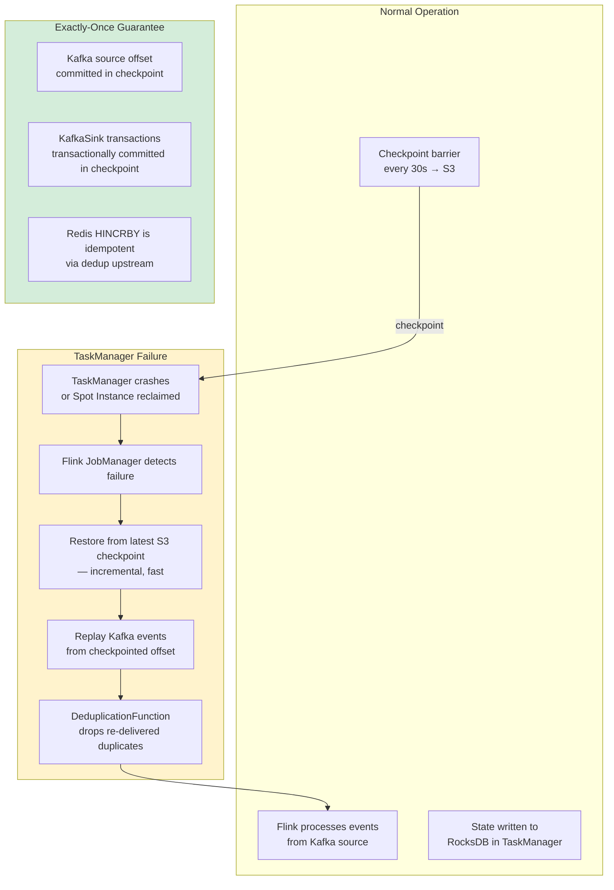
```mermaid
flowchart TD
    subgraph Normal["Normal Operation"]
        N1[Flink processes events\nfrom Kafka source]
        N2[State written to\nRocksDB in TaskManager]
        N3[Checkpoint barrier\nevery 30s → S3]
    end

    subgraph Failure["TaskManager Failure"]
        F1[TaskManager crashes\nor Spot Instance reclaimed]
        F2[Flink JobManager detects failure]
        F3[Restore from latest S3 checkpoint\n— incremental, fast]
        F4[Replay Kafka events\nfrom checkpointed offset]
        F5[DeduplicationFunction\ndrops re-delivered duplicates]
    end

    subgraph Guarantee["Exactly-Once Guarantee"]
        E1[Kafka source offset\ncommitted in checkpoint]
        E2[KafkaSink transactions\ntransactionally committed in checkpoint]
        E3[Redis HINCRBY is idempotent\nvia dedup upstream]
    end

    N3 -->|checkpoint| F1
    F1 --> F2 --> F3 --> F4 --> F5
    F5 --> N1

    style Failure fill:#fff3cd
    style Guarantee fill:#d4edda
```

---

## 9. Observability

### 9.1. SLIs and SLOs

| SLI | Window | SLO Target | Alert Threshold |
|:----|:-------|:-----------|:----------------|
| **Ingress availability** | 5-min rolling | > 99.99% | 5xx rate > 0.1% |
| **End-to-end freshness** | event_ts → Pinot queryable | < 3.0 s (P95) | P95 > 10 s |
| **API latency (P95)** | Read queries | < 200 ms | P95 > 500 ms for 3 min |
| **Data correctness drift** | Daily reconciliation | 0.00% | Drift > 0.05% |
| **Flink consumer lag** | Kafka topic | < 100K messages | > 500K messages |
| **Redis auto-patch rate** | Hourly reconciliation | < 0.1% campaigns | > 1% campaigns patched |

### 9.2. Metrics Catalogue

```mermaid
graph LR
    M(("📊 Metrics"))

    subgraph IS_grp["🔄  ingestion-service"]
        direction TB
        IS1["ads.ingest.events.received"]
        IS2["ads.ingest.events.accepted"]
        IS3["ads.ingest.events.rejected"]
        IS4["ads.ingest.events.dlq"]
        IS5["ads.ingest.rate.limited"]
        IS6["ads.ingest.latency.ms"]
    end

    subgraph SPE_grp["⚡  stream-processing-engine"]
        direction TB
        SPE1["ads.events.processed"]
        SPE2["ads.events.dedup.dropped"]
        SPE3["ads.events.attributed"]
        SPE4["ads.processing.latency.ms"]
        SPE5["flink.checkpoint.duration"]
        SPE6["flink.consumer.lag"]
    end

    subgraph QS_grp["🔍  insights-query-service"]
        direction TB
        QS1["ads.queries.total"]
        QS2["ads.queries.latency.ms"]
        QS3["ads.cache.hits — redis"]
        QS4["ads.cache.misses — redis"]
        QS5["ads.tier.redis.count"]
        QS6["ads.tier.pinot.count"]
        QS7["ads.tier.trino.count"]
    end

    subgraph R_grp["🔁  reconciliation"]
        direction TB
        R1["ads.reconciliation.runs.total"]
        R2["ads.reconciliation.discrepancies"]
        R3["ads.reconciliation.auto.patches"]
        R4["ads.reconciliation.latency.ms"]
        R5["ads.reconciliation.campaigns.checked"]
    end

    M --> IS_grp
    M --> SPE_grp
    M --> QS_grp
    M --> R_grp

    style IS_grp  fill:#e3f2fd,stroke:#1565c0,color:#0d1b2a
    style SPE_grp fill:#e8f5e9,stroke:#2e7d32,color:#0d1b2a
    style QS_grp  fill:#fff3e0,stroke:#e65100,color:#0d1b2a
    style R_grp   fill:#f3e5f5,stroke:#6a1b9a,color:#0d1b2a
```

---

## 10. Trade-offs & Design Decisions

```mermaid
quadrantChart
    title Architectural Trade-off Map
    x-axis Low Consistency --> High Consistency
    y-axis Low Performance --> High Performance
    quadrant-1 Ideal hot path
    quadrant-2 Risky fast path
    quadrant-3 Avoid
    quadrant-4 Reconciliation needed
    Redis Hot Tier: [0.9, 0.95]
    Pinot Warm Tier: [0.7, 0.80]
    Trino Cold Tier: [0.95, 0.30]
    Kafka Buffer: [0.6, 0.85]
    Flink Exactly-Once: [0.90, 0.60]
```

| Decision | Alternative Considered | Chosen Approach | Rationale |
|:---------|:----------------------|:----------------|:----------|
| **Token format** | JWT (RS256) | PASETO v4 | Eliminates `alg:none` + algorithm-confusion; Ed25519 fixed — no negotiation |
| **Kafka partition key** | `campaign_id` | `hash(tenantId + sessionId)` | Even load distribution; co-locates session events for attribution join without cross-node shuffle |
| **Hot-tier store** | Cassandra counters | Redis `HINCRBY` | Sub-ms latency; Active-Active CRDT for multi-region; also backs rate limiter |
| **Warm-tier store** | ClickHouse | Apache Pinot | Star-Tree pre-aggregation; native Kafka real-time tables; thousands QPS at <15ms |
| **State backend** | HashMapStateBackend | RocksDB incremental | Unlimited state size for billions of sessions; incremental S3 checkpoints; Spot-safe |
| **Attribution timer** | Event-time window | Processing-time timer | 24h business policy; simpler under backpressure; no watermark dependency |
| **Schema format** | JSON / Protobuf | Confluent Avro binary | 70% smaller than JSON; Schema Registry enforces compatibility; native Flink/Kafka integration |
| **Dedup TTL** | Unbounded state | 60-minute TTL | Covers all retry windows; bounds RocksDB growth; SDK retries don't exceed 30 min |
| **Reconciliation cadence** | Nightly batch | Hourly + daily | Hourly catches Redis drift within the hot window; daily validates financial accuracy against Iceberg source-of-truth |
| **Cold tier query** | Keep in Pinot | Iceberg + Trino | ~90% storage cost saving for >30d data; compute decoupled from storage; Trino auto-scales |
| **Token exchange (Option C)** | Forward external token | Re-mint `v4.local` | External token never enters the mesh; short TTL (60s) limits blast radius; symmetric is faster to verify in-service |
| **Rate limiting** | Application-layer only | Edge (Kong) + Service (Redis) | Defense in depth; edge blocks burst before it reaches JVM; service-layer enforcer survives edge misconfiguration |

